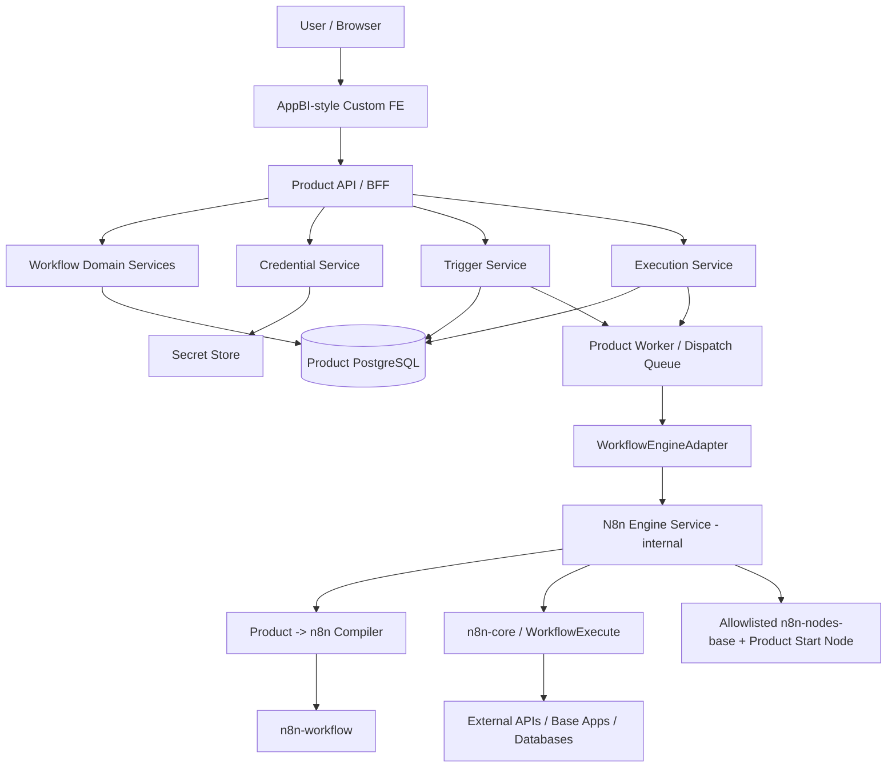
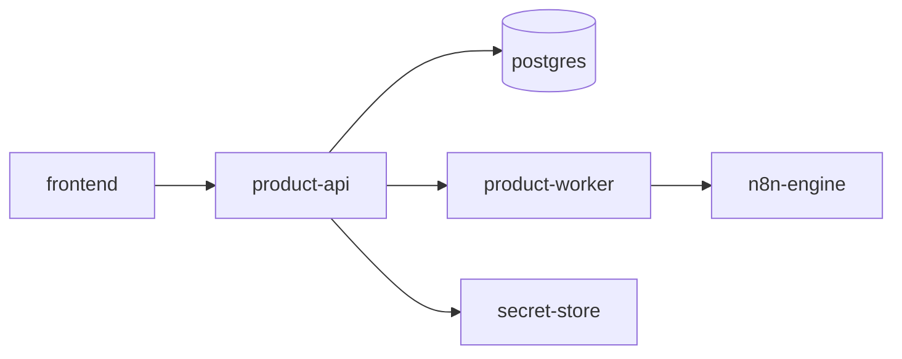
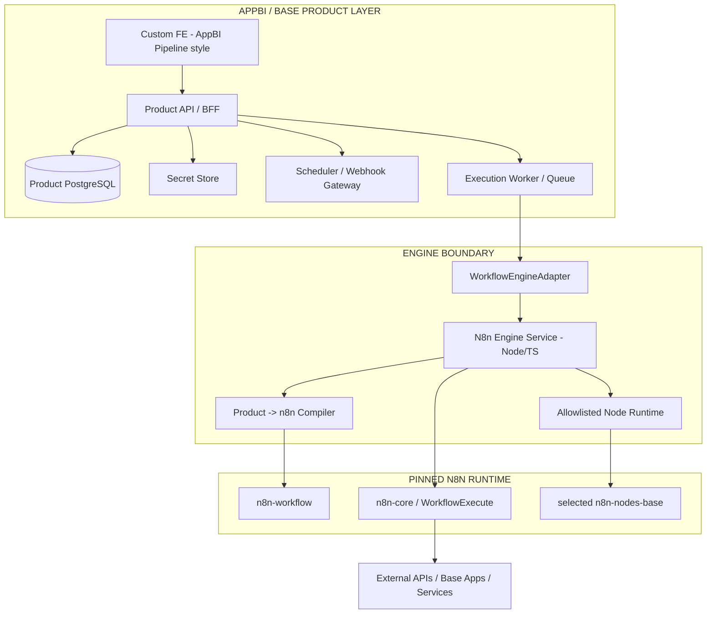

# Mục lục nhanh

| Phần | Nội dung chính | Sections |
|---|---|---|
| A | Tầm nhìn, scope, kiến trúc, persona, UX foundation | 0-9 |
| B | Core product modules: Workspace, Node Registry, Credential, Workflow, Editor, Mapping, Execution, Trigger | 10-17 |
| C | Monitoring, Alert, Audit, Secrets, Data Model, API, WorkflowEngineAdapter và n8n Runtime | 18-29 |
| D | Scale, upgrade, security, licensing và error UX | 30-34 |
| E | Screen specification, FE/BE boundaries, AppBI integration, NFR, testing, UAT | 35-46 |
| F | Backlog, phase plan, ADR, risk, production checklist và API examples | 47-54 |
| G | Node certification, runbooks, retention, privacy, component/page patterns | 55-63 |
| H | Multi-tenancy, engine abstraction, scheduler/webhook ownership, versioning, expressions, locking, supportability | 64-84 |
| I | Final architecture, kết luận và phụ lục go-live | 85-86 + Phụ lục |

**Cách đọc cho Dev Lead:** đọc 0-9 để hiểu product boundary; 10-29 để implement domain/runtime; 30-46 để productionize; 47 trở đi dùng làm backlog, release gate và runbook.

# 0. Thông tin tài liệu

**Tên sản phẩm làm việc:** AppBI Workflow Automation Platform. Tên thương mại có thể đổi sau; trong tài liệu gọi ngắn là **Workflow** hoặc **Automation**.  
**Loại tài liệu:** BA + SRS + Product Architecture + Functional Specification.  
**Phiên bản:** 1.0 - Baseline cho V1 production-ready.  
**Ngày:** 04/09/2026.  
**Đối tượng đọc:** Product Owner, BA, UI/UX, Frontend, Backend, Engine/Runtime Dev, DevOps/SRE, QA, Security, Tech Lead.  
**Mục tiêu:** Sau khi đọc tài liệu này, đội dev phải xác định được sản phẩm cần làm gì, màn hình nào cần có, object nào thuộc Product, object nào thuộc n8n runtime, dữ liệu nào cần lưu, luồng execution nào phải chạy, boundary nào không được vi phạm và tiêu chí nào để được coi là hoàn thành.

> **Quyết định kiến trúc quan trọng nhất:** n8n được sử dụng như một **Workflow Execution Engine nằm phía sau**, không phải một application/backend nghiệp vụ mà frontend gọi trực tiếp. Product sở hữu Workflow, Workflow Version, Trigger, Credential reference, Execution history, RBAC, Audit và UX.

> **Quyết định kỹ thuật quan trọng nhất:** Không chạy nguyên n8n CLI/server làm backend chính, không fork n8n rồi xóa FE, không lưu `n8n_workflow_id` làm business truth. Một service Node.js/TypeScript nội bộ gọi `n8n-workflow`, `n8n-core` và các node được allowlist; Product Backend giao tiếp với service này thông qua `WorkflowEngineAdapter`.

> **Quyết định thiết kế quan trọng nhất:** FE kế thừa trực tiếp design language của `QuangChinhDE/appbi-pipeline`: Next.js + React + TypeScript + Tailwind semantic tokens, sidebar workspace, grouped navigation theo user intent, information density vừa phải, surface/text/brand/status token, component compact và error UX có remediation.

## 0.1. Nguồn tham chiếu đã kiểm tra

Tài liệu này được xây từ các nguồn sau:

1. Tài liệu BA/SRS AppBI Data Integration Platform dùng Airbyte làm engine - dùng làm mẫu về độ sâu, guardrail, format, UAT, release gate và cách tách Product khỏi upstream engine.
2. `https://github.com/QuangChinhDE/appbi-pipeline` - implementation hiện tại để kế thừa Product API/BFF, adapter boundary, workspace/RBAC, error envelope, compatibility matrix và FE design language.
3. `appbi-pipeline/frontend/tailwind.config.js` - semantic tokens, typography, radius, shadows.
4. `appbi-pipeline/frontend/src/components/layout/Sidebar.tsx` - sidebar `w-14`/`w-60`, grouped navigation, permission gating, workspace switch và progressive disclosure.
5. `appbi-pipeline/frontend/package.json` - Next.js 15.x, React 18, TypeScript, Tailwind, TanStack Query, Lucide, Sonner.
6. `https://github.com/n8n-io/n8n` - n8n monorepo.
7. `packages/workflow` - package `n8n-workflow`, workflow model, expression/runtime types.
8. `packages/core` - package `n8n-core`, execution engine; `WorkflowExecute` là lớp execution trọng yếu.
9. `packages/nodes-base` - base node implementations và credential definitions.
10. `LICENSE.md` của n8n - Sustainable Use License và các hạn chế với `.ee`/Enterprise code.

**Snapshot kỹ thuật tại thời điểm viết:** branch `master` được kiểm tra đang khai báo `n8n-workflow`, `n8n-core`, `n8n-nodes-base` ở line 2.37.x. Đây chỉ là snapshot tham chiếu; production **MUST pin exact tag/commit/package set đã được contract-test**, không dựa vào chữ “latest” hay branch master.

## 0.2. Phạm vi tài liệu

Tài liệu mô tả một sản phẩm workflow automation dùng được thực tế:

- authentication và workspace;
- node registry;
- workflow CRUD/versioning;
- visual canvas;
- node configuration;
- expression/data mapping;
- credentials;
- manual/webhook/schedule trigger;
- execution/cancel/retry;
- logs và node-level result;
- monitoring/alert/audit;
- multi-tenancy;
- Product API;
- Workflow Engine Service;
- n8n adapter/compiler/runtime;
- upgrade/compatibility;
- security;
- licensing gate;
- test/UAT;
- deployment/scale;
- backlog và runbook.

Các requirement đánh dấu **MUST** là bắt buộc cho V1 hoặc là architecture guardrail không được phá.

# 1. Tầm nhìn sản phẩm

## 1.1. Problem statement

n8n có execution engine, workflow graph, expression model và hệ sinh thái node mạnh. Nhưng nếu dùng nguyên n8n application thì sản phẩm sẽ bị kéo theo:

- n8n Editor UI;
- n8n user/project/RBAC;
- n8n credentials database;
- n8n webhook server;
- n8n scheduler;
- n8n execution persistence;
- queue/worker/Redis khi scale;
- AI/MCP/chat/telemetry và nhiều module không nằm trong scope Product;
- object model, URL, API và UX của n8n;
- upgrade coupling rất lớn.

Mục tiêu của hệ thống không phải là “white-label n8n UI”, mà là giữ năng lực thực thi workflow của n8n trong một Product riêng, đồng nhất với AppBI/Base Data Platform.

Sản phẩm phải trả lời được các câu hỏi của user mà không yêu cầu user biết n8n internals:

1. Tôi đang tự động hóa việc gì?
2. Workflow bắt đầu khi nào?
3. Mỗi bước làm gì và lấy dữ liệu từ đâu?
4. Credential nào đang được dùng?
5. Lần chạy gần nhất thành công hay thất bại?
6. Bước nào lỗi và tôi cần làm gì tiếp?
7. Nếu sửa workflow, phiên bản nào đang chạy production?

## 1.2. Product vision

Xây một “Automation Hub” trong hệ sinh thái AppBI/Base Data Platform, nơi user có thể kéo-thả các bước, cấu hình trigger, map dữ liệu, chạy thử, publish và theo dõi execution qua giao diện AppBI-style.

n8n chỉ là **runtime implementation** của execution contract.

## 1.3. Mục tiêu kinh doanh

| ID | Mục tiêu | Kết quả kỳ vọng |
|---|---|---|
| BG-01 | Rút ngắn thời gian tạo automation | Workflow đơn giản tạo được trong <= 10 phút |
| BG-02 | Đồng nhất UX trong hệ sinh thái | 100% user-facing flow đi qua FE của Product |
| BG-03 | Không vendor-lock Product model vào n8n application | Product DB không cần `n8n_workflow_id` |
| BG-04 | Tận dụng execution semantics mature | Branch/merge/expression/node execution dùng n8n runtime |
| BG-05 | Dễ nâng n8n | Upgrade chủ yếu tác động engine adapter/compiler và certification |
| BG-06 | Dùng được cho non-tech | Node config rõ, data mapping trực quan, lỗi có next action |
| BG-07 | Sẵn sàng thương mại | Multi-tenancy, RBAC, audit, secrets, observability, license gate |
| BG-08 | Sẵn sàng mở rộng node | Product Node Registry có allowlist/certification, không expose 500 node vô kiểm soát |

## 1.4. Chỉ số sản phẩm đề xuất

| Metric | Target V1 |
|---|---:|
| Median time tạo workflow 3-5 bước và chạy thành công | <= 10 phút |
| Tỷ lệ manual test execution trả kết quả có node-level status | >= 99% khi engine healthy |
| Product API p95 cho CRUD không chạy engine | <= 500-700 ms |
| Engine dispatch p95 trước khi workflow bắt đầu | <= 3s trong điều kiện bình thường |
| Product Control Plane availability | >= 99.9%/tháng |
| Lỗi known-class có human-readable remediation | >= 95% |
| Certified node regression coverage | 100% node V1 |
| n8n upgrade regression coverage | 100% core engine contract tests |
| Secret leakage critical test | 0 failure |

# 2. Nguyên tắc kiến trúc và Product Guardrails

## 2.1. Guardrails bắt buộc

1. **FE MUST NOT gọi n8n trực tiếp.** FE chỉ gọi Product API/BFF.
2. **Product Backend MUST NOT phụ thuộc n8n types.** Không được để `INode`, `IRun`, `WorkflowExecute`, `n8n-nodes-base.*` lan vào domain service/public API.
3. **Product là system of record cho Workflow.** Workflow graph, draft, published version, trigger config, credential reference và execution summary nằm trong Product DB.
4. **V1 MUST NOT cần n8n metadata DB.** Không dựng n8n application database chỉ để Product chạy workflow.
5. **MUST NOT lưu `n8n_workflow_id` trên Product Workflow.** Nếu một implementation sau này cần engine handle thì dùng mapping/opaque ref ở adapter layer.
6. **Trigger ownership thuộc Product.** Manual, webhook và schedule được Product nhận/lập lịch rồi dispatch execution; không dùng n8n webhook server/scheduler làm public control plane ở V1.
7. **Credential ownership thuộc Product.** Secret nằm ở Product Secret Store/encrypted vault; n8n chỉ nhận credential resolved tại execution time.
8. **Node catalog thuộc Product.** FE chỉ thấy node đã được allowlist, normalize và certification.
9. **Raw n8n node type/version không xuất hiện trong public API.** `n8n-nodes-base.httpRequest` là engine binding, không phải Product node key.
10. **Chỉ Workflow Engine Service được import n8n packages.** Product API, worker và FE không import `n8n-core`.
11. **Version MUST pinned.** Không dùng `latest`, caret range hoặc branch master cho production.
12. **MUST NOT import/use `.ee` hoặc Enterprise-only source** nếu chưa có commercial/Enterprise license tương ứng.
13. **Code node, community nodes, arbitrary package execution MUST disabled ở V1.**
14. **Wait/resume semantics, long-lived execution và human approval MUST out-of-scope V1** trừ khi persistence design được bổ sung riêng.
15. **Engine service internal-only.** Không expose public route/port cho end user.
16. **Product error contract MUST normalized.** FE không parse raw stack trace/n8n error class.
17. **Published version immutable.** Active trigger luôn trỏ vào một published workflow version cụ thể.
18. **Run MUST bind vào exact workflow version.** Execution history không bị thay đổi khi user sửa draft sau này.
19. **Workspace scope là backend security boundary.** Mọi workflow/credential/execution query scope workspace.
20. **FE MUST reuse AppBI Pipeline design system;** không copy n8n Editor UI/design system rồi đổi màu.

## 2.2. Kiến trúc mục tiêu



### Component ownership

| Component | Owner | Trách nhiệm |
|---|---|---|
| Custom FE | Product team | Workflow UX, canvas, data mapping, list/detail, execution viewer |
| Product API/BFF | Product team | Auth, RBAC, workspace, workflow CRUD/versioning, normalized error |
| Product DB | Product team | Workflow/draft/version, trigger, execution summary, audit, metadata |
| Secret Store | Product/Infra | Credential secret, OAuth token, encryption lifecycle |
| Product Worker | Product team | Schedule tick, dispatch, reconciliation, alert/cleanup |
| WorkflowEngineAdapter | Product team | Stable Product contract -> Engine Service contract |
| N8n Engine Service | Product team | Process boundary cho n8n runtime |
| Compiler/Node Adapter | Product team | Product graph/config -> n8n Workflow/node types |
| n8n-workflow | upstream n8n | Workflow model, expressions, common runtime types |
| n8n-core | upstream n8n | Workflow execution semantics, `WorkflowExecute` |
| n8n-nodes-base | upstream n8n | Node implementations được allowlist/certify |
| n8n Editor/CLI | Không dùng V1 | Không thuộc kiến trúc Product |

## 2.3. Điều sản phẩm tuyệt đối không trở thành

Không được tiến hóa theo hướng:

```text
AppBI FE
   -> n8n REST API
   -> n8n DB
   -> n8n Webhook
   -> n8n Scheduler
   -> n8n Worker
```

Nếu implementation cần thêm một thành phần upstream, phải chứng minh nó là execution dependency không thể cung cấp qua Engine Service và phải có ADR.

# 3. Phạm vi V1, V1.1 và ngoài phạm vi

## 3.1. In scope - V1 bắt buộc

| Nhóm | Feature V1 |
|---|---|
| Identity | Login/logout, workspace switch, current user/session |
| Workspace | Workspace, member, role, permission |
| Node Library | Product-owned node registry, search/category/certification |
| Core Trigger | Manual, Webhook, Schedule |
| Core Action/Logic | HTTP Request, Edit Fields, IF, Switch, Merge |
| Workflow | Create/edit/rename/duplicate/delete, draft, validation |
| Versioning | Publish immutable version, activate/deactivate |
| Canvas | Add/move/connect/delete/duplicate node, zoom/pan, undo/redo |
| Node Config | Dynamic form, advanced section, validation |
| Data Mapping | Expression mode, previous-node data browser, mapping picker |
| Credential | Create/edit/delete, masked secrets, runtime resolve |
| Execution | Manual run, scheduled/webhook run, status, cancel, retry whole workflow |
| Node Result | Input/output preview, duration, error per node |
| History | Execution list/detail, filter |
| Monitoring | Basic health/metrics |
| Alert | In-app alert cho failed/repeated failure |
| Security | Secret handling, RBAC, tenant isolation, SSRF controls |
| Operations | Engine health, compatibility/version visibility |
| QA | Unit/integration/engine contract/E2E/UAT |
| Legal | n8n commercial/license gate trước commercial release |

### V1 certified node set

**Product trigger nodes**
- `manual_trigger`
- `webhook_trigger`
- `schedule_trigger`

**Engine-backed processing nodes**
- `http_request`
- `edit_fields`
- `if`
- `switch`
- `merge`

V1 có thể thêm 1-3 Base-native nodes nếu business cần rõ ràng, nhưng phải đi qua cùng Node Registry/certification.

## 3.2. V1.1 / ưu tiên ngay sau V1

- Google Sheets, Slack, Gmail hoặc các integration được chọn theo business.
- Base.vn application nodes.
- OAuth2 credential UX hoàn chỉnh.
- Workflow template.
- Folder/tag.
- Partial execution “Run from here”.
- Pin sample data cho mapping.
- Execution compare giữa hai version.
- Workflow import/export Product format.
- Webhook response customization.
- Binary/file payload hỗ trợ production-grade.
- Sub-workflow được Product quản lý.
- Approval/Wait nếu có persistence design.
- SSE/WebSocket live execution.
- Node documentation side panel.
- Usage/quota dashboard.

## 3.3. Out of scope V1

- n8n Editor UI.
- n8n CLI/server làm Product backend.
- n8n user/project/RBAC.
- n8n credential database.
- n8n templates marketplace.
- Community node install từ UI.
- Code node / arbitrary JS.
- Execute Command / shell node.
- AI Agent/LangChain nodes.
- MCP.
- Chat Hub.
- n8n AI workflow builder.
- Git/source-control của n8n.
- Wait node/long-running resume.
- Human-in-the-loop approval.
- Multi-main worker Redis queue theo mô hình n8n full.
- Cho customer truy cập raw n8n API.
- Fork lớn n8n source.

# 4. Đối tượng sử dụng và RBAC

## 4.1. Persona

| Persona | Nhu cầu | Hành vi |
|---|---|---|
| Workspace Owner | Quản lý workspace, permission, credential policy | Full access |
| Automation Admin | Build/publish/activate workflow | Build + operate |
| Automation Builder | Tạo/sửa/test workflow | Draft + test |
| Operator | Theo dõi, cancel/retry execution | Operate |
| Viewer/Analyst | Xem workflow/execution | Read-only |
| Auditor/Security | Xem audit, credential events | Read audit/security |
| Platform Admin | Engine compatibility, node certification | System-level |

## 4.2. Permission model đề xuất

| Module | view | create | edit | execute | publish | delete | admin |
|---|---:|---:|---:|---:|---:|---:|---:|
| workflows | ✓ | ✓ | ✓ | ✓ | ✓ | ✓ | manage sharing/policy |
| credentials | ✓ metadata | ✓ | ✓ | use | - | ✓ | secret policy |
| executions | ✓ | - | - | retry/cancel | - | retention-dependent | debug |
| nodes | ✓ | - | - | - | - | - | certify/disable |
| alerts | ✓ | ✓ | ✓ | acknowledge | - | ✓ | channel config |
| audit | ✓ | - | - | - | - | - | export |
| members | ✓ | invite | edit role | - | - | remove | owner |
| settings | ✓ | - | edit | - | - | - | engine/admin |

### Rules

- FE gating chỉ phục vụ UX; backend là nguồn quyết định cuối cùng.
- Credential `view` không có nghĩa là xem plaintext.
- Quyền `execute` khác quyền `publish`.
- Viewer không được chạy test node nếu test có external side effect.
- Platform Admin không mặc nhiên được xem secret plaintext.

# 5. Thuật ngữ chuẩn dùng trong UI

| Product term | Ý nghĩa | n8n mapping bên trong |
|---|---|---|
| Workflow | Luồng automation do Product sở hữu | `Workflow` object runtime |
| Draft | Bản đang sửa | Product-only |
| Published Version | Snapshot immutable dùng để activate/run | Compiled thành n8n workflow |
| Node | Một bước trong workflow | `INode` / node implementation |
| Trigger | Điểm bắt đầu | Product-owned start event |
| Action | Bước gọi service/thao tác | n8n node |
| Logic | IF/Switch/Merge | n8n node |
| Connection | Đường nối giữa node/port | n8n connections |
| Credential | Thông tin xác thực | Product secret -> runtime credential |
| Expression | Công thức lấy/map dữ liệu | n8n expression runtime |
| Execution | Một lần chạy workflow | normalized từ `IRun` |
| Node run | Kết quả một node trong Execution | normalized task/run data |
| Activate | Bật trigger cho published version | Product trigger binding enabled |
| Engine | Runtime thực thi workflow | n8n-core service |

**Không hiển thị mặc định:** `INode`, `IRun`, `WorkflowExecute`, `typeVersion`, `runExecutionData`, `n8n-nodes-base.*`, DI container internals.

# 6. Information Architecture và Navigation

## 6.1. Sidebar đề xuất

Kế thừa trực tiếp sidebar pattern AppBI Pipeline: collapsed `w-14`, expanded `w-60`, workspace switch, permission gating, grouped navigation.

**Top**
- Overview

**BUILD**
- Workflows
- Credentials

**OPERATE**
- Executions
- Monitoring
- Alerts

**MANAGE**
- Node Library
- Audit Log

**Settings**
- Workspace
- Members & Roles
- Engine & Compatibility (admin)
- Security / Credential policy

Nếu đây là app độc lập trong Base Data Platform, giữ Product shell riêng nhưng token/component phải dùng chung. Không nhét module vào n8n navigation.

## 6.2. URL contract FE

| Screen | Route |
|---|---|
| Overview | `/overview` |
| Workflows | `/workflows` |
| Create Workflow | `/workflows/new` |
| Workflow Editor | `/workflows/[id]` |
| Workflow Versions | `/workflows/[id]/versions` |
| Executions | `/executions` |
| Execution Detail | `/executions/[id]` |
| Credentials | `/credentials` |
| Credential Detail/Edit | `/credentials/[id]` |
| Node Library | `/nodes` |
| Monitoring | `/monitoring` |
| Alerts | `/alerts` |
| Audit | `/audit` |
| Access | `/settings/access` |
| Workspace | `/settings/workspace` |
| Engine | `/settings/engine` |

# 7. FE Design System Specification

## 7.1. Technology baseline

Reuse stack AppBI Pipeline hiện tại:

- Next.js App Router.
- React + TypeScript.
- TailwindCSS semantic tokens.
- TanStack Query cho server state.
- Lucide icons.
- Sonner/toast abstraction.
- `clsx` + `tailwind-merge` / `cn`.
- Existing i18n provider.
- Radix primitives nếu project đã dùng/được chuẩn hóa.
- **Canvas recommendation:** `@xyflow/react` hoặc library tương đương, pin exact version bằng lockfile/ADR. Không copy canvas implementation của n8n.

Không tạo design system thứ hai.

## 7.2. Visual language

Reuse token hiện có của AppBI Pipeline:

- `surface-0..3`, `surface-inverse`.
- `text-primary`, `text-secondary`, `text-tertiary`, `text-quaternary`.
- `brand`, `brand-hover`, `brand-active`, `brand-soft`.
- `success`, `warning`, `danger`, `info`.
- Radius chủ đạo 6-8px; 12px cho modal/card lớn.
- Shadow `linear-sm`, `linear`, `linear-lg`, `popover`.
- Typography compact: caption/small/body; editor ưu tiên information density.
- Motion ngắn 150-300ms, không animation gây phân tâm.

## 7.3. Page patterns bắt buộc

### List Page

1. Header: title, description, primary CTA.
2. Overview strip/statistics nếu hữu ích.
3. Search + filter + sort.
4. Table/list.
5. Bulk action khi có selection.
6. Empty state có CTA.
7. Loading skeleton.
8. Partial section error không làm trắng cả page.

### Detail Page

- Breadcrumb/back.
- Title + lifecycle/health badge.
- Actions phải state-aware.
- Tabs cố định.
- Technical details progressive disclosure.

### Workflow Editor

Editor là page riêng, không phải modal.

Layout desktop:

```text
┌──────────────────────────────────────────────────────────────────────────────┐
│ ← Workflows   Customer onboarding   Draft saved   [Publish] [Run] [•••]    │
├──────────────┬──────────────────────────────────────────┬────────────────────┤
│ Node palette │                                          │ Node configuration │
│ / collapsed  │                 Canvas                   │ / Data mapping      │
│              │                                          │                    │
│              │  Trigger -> HTTP -> IF -> Edit Fields    │                    │
├──────────────┴──────────────────────────────────────────┴────────────────────┤
│ Execution data panel: Input | Output | Error | Logs                 [collapse]│
└──────────────────────────────────────────────────────────────────────────────┘
```

**Canvas behavior MUST**
- pan/zoom;
- fit view;
- add node bằng `+` hoặc command palette;
- drag node;
- connect port;
- highlight invalid connection;
- delete/duplicate;
- multi-select;
- copy/paste trong cùng workflow;
- undo/redo;
- keyboard shortcuts;
- node status overlay khi đang/đã test execution;
- `Run` phải chạy version/draft xác định rõ, không “đoán” state local.

### Node configuration panel

- Right panel 380-520px tùy viewport.
- Tabs/sections: Parameters, Settings; Credentials nằm trong Parameters ở vị trí dễ thấy.
- Basic trước, Advanced collapse.
- Dynamic fields theo config schema.
- Expression toggle ở field hỗ trợ mapping.
- Validation inline.
- Save draft tự động hoặc explicit theo Section 69.

### Execution data panel

- Collapsible bottom panel.
- Chọn node -> xem Input/Output/Error.
- JSON tree + table mode khi phù hợp.
- Search key/value.
- Không tải payload quá lớn; pagination/truncation.
- Sensitive field redacted.

## 7.4. Responsive

- Desktop >= 1280px là primary editor target.
- Tablet cho list/detail/monitoring; canvas vẫn dùng được ở mức cơ bản.
- Mobile V1 không cần full workflow editing, nhưng phải xem workflow/execution/alert.
- Sidebar mobile chuyển drawer.

# 8. System Context và kiến trúc logic

## 8.1. Save path

**Save draft không gọi n8n.**

```text
Browser
  -> Product API
  -> WorkflowService
  -> validate Product graph/schema
  -> Product DB
```

N8n runtime không phải source of truth và không tham gia mỗi thao tác drag/drop/save.

## 8.2. Publish path

```text
Draft
  -> Product validation
  -> engine compatibility validation
  -> freeze immutable WorkflowVersion
  -> compiler dry-run / validation
  -> publish version
```

Nếu compile validation fail, không publish.

## 8.3. Execution path

```text
POST /workflows/{id}/executions
  -> check permission/workspace
  -> resolve exact draft/published version
  -> create Product Execution = QUEUED
  -> dispatch to Product Worker
  -> WorkflowEngineAdapter.execute()
  -> N8n Engine Service
  -> compile Product graph to n8n Workflow
  -> WorkflowExecute.run()
  -> normalize lifecycle/node results
  -> Product Execution = terminal state
```

## 8.4. Trigger path

```text
Manual button / Webhook Gateway / Product Scheduler
        -> TriggerService
        -> create Execution against published version
        -> same ExecutionService path
```

Không có ba execution systems khác nhau cho ba loại trigger.

## 8.5. Engine result strategy

Engine Service có thể push status/event về Product Worker hoặc Product Worker poll internal operation. V1 chấp nhận polling/internal callback; browser chỉ poll Product API.

# 9. End-to-end User Journeys

## 9.1. Journey A - First successful manual workflow

1. User vào Workflows > New workflow.
2. Canvas có `Manual Trigger`.
3. User add `HTTP Request`.
4. Kết nối Trigger -> HTTP.
5. Chọn method/URL.
6. Add `IF`, map `{{$json...}}` từ HTTP output.
7. Add `Edit Fields`.
8. Bấm Run.
9. Draft được persist trước khi run.
10. Execution tạo ở trạng thái QUEUED.
11. Canvas hiển thị node status Running/Success theo Product execution data.
12. User click từng node xem Input/Output.
13. Nếu hợp lệ, user Publish.
14. Published version immutable được tạo.

**Acceptance:** Không có n8n UI, n8n workflow ID hoặc raw IRun xuất hiện với user.

## 9.2. Journey B - Webhook workflow

1. User add `Webhook Trigger`.
2. Cấu hình method/path/auth mode.
3. Publish workflow.
4. Activate.
5. Product tạo stable webhook URL.
6. Request bên ngoài gọi Product Webhook Gateway.
7. Gateway validate method/auth/body size/idempotency.
8. Gateway tạo Execution cho published version đang active.
9. Engine nhận payload làm start input.
10. Execution history ghi `trigger_type=WEBHOOK`.

## 9.3. Journey C - Scheduled workflow

1. Add Schedule Trigger.
2. Chọn Every hour/Daily/Cron + timezone.
3. Publish.
4. Activate.
5. Product Scheduler tính `next_run_at`.
6. Đến giờ, tạo Execution.
7. Nếu previous execution vẫn active và overlap policy = SKIP, không chạy chồng.
8. Audit/metric ghi trigger decision.

## 9.4. Journey D - Credential invalid

1. HTTP/API node fail authentication.
2. Adapter normalize `AUTHENTICATION`.
3. Canvas/execution detail highlight node lỗi.
4. Error card CTA `Update credential`.
5. User update secret + Test.
6. Retry tạo Execution mới liên kết run cũ.

## 9.5. Journey E - User sửa workflow đang active

1. Workflow version 3 đang active.
2. User mở editor và sửa draft.
3. Schedule/webhook vẫn chạy version 3.
4. User Run Draft để test.
5. User Publish -> version 4.
6. User Activate version 4.
7. Từ thời điểm activate, trigger mới chạy version 4.
8. Execution history cũ vẫn trỏ version 3.

## 9.6. Journey F - Engine unavailable

1. User vẫn login/list workflow từ Product DB.
2. Editor vẫn mở draft.
3. Run/Publish engine validation có thể trả `ENGINE_UNAVAILABLE`.
4. Không crash app.
5. Existing read-only Product data vẫn sử dụng được.
6. Operator thấy Engine degraded ở admin/monitoring.

# 10. Module Specification - Authentication & Workspace

## 10.1. Authentication

Nếu tích hợp Base/AppBI identity, reuse auth/session hiện có. Nếu standalone, Product API vẫn cần tương đương:

- secure cookie/session;
- refresh;
- logout invalidation;
- brute-force/rate limit;
- SSO extension point.

## 10.2. Workspace switch

- Workspace switcher dùng pattern AppBI Pipeline.
- Switch workspace -> clear workspace-scoped TanStack Query cache.
- Canvas đang dirty phải cảnh báo trước khi switch hoặc persist draft.
- Current workspace lấy từ authenticated server context, không tin `workspace_id` user gửi tùy ý.

## 10.3. Workspace object

| Field | Type | Notes |
|---|---|---|
| id | UUID | Product-owned |
| name | string | |
| slug | string | |
| status | enum | ACTIVE/SUSPENDED/DELETED |
| timezone | IANA timezone | schedule |
| region | nullable | future engine routing |
| created_at | timestamptz | |

# 11. Module Specification - Node Registry

## 11.1. Mục tiêu

Node Registry là product-owned catalog để FE và Product domain biết node nào được phép sử dụng. Nó che giấu raw n8n metadata và là nơi áp dụng certification/security policy.

**Rule:** n8n có node không đồng nghĩa Product phải expose node đó.

## 11.2. Node tiers

### Tier A - Product Native / Curated Core

Các node Product quyết định UX/schema ổn định:

- Manual Trigger
- Webhook Trigger
- Schedule Trigger
- HTTP Request
- Edit Fields
- IF
- Switch
- Merge

Product schema là source of UI truth.

### Tier B - Engine-backed Integrations

Các node như Slack/Google Sheets/Gmail/Base Apps có thể dùng metadata n8n làm input cho adapter normalization, nhưng FE vẫn chỉ nhận Product `NodeDefinition`.

## 11.3. NodeDefinition normalized

| Field | Description |
|---|---|
| node_key | Stable Product key, ví dụ `http_request` |
| display_name | HTTP Request |
| category | TRIGGER/ACTION/LOGIC/DATA/APP |
| description | user-facing |
| icon | Product asset/token |
| config_schema | normalized form schema |
| input_ports | Product port definitions |
| output_ports | Product port definitions |
| supports_expression | fields/capability |
| credential_types | Product credential types |
| certification | SUPPORTED/BETA/HIDDEN/BLOCKED |
| product_schema_version | Product config version |
| engine_binding | backend-only |
| security_profile | network/code/file/external side effect |
| docs_ref | Product docs |
| status | ACTIVE/DISABLED/DEPRECATED |

### Engine binding example

```json
{
  "engine": "N8N",
  "engine_node_type": "n8n-nodes-base.httpRequest",
  "engine_type_version": 4,
  "adapter_version": "1"
}
```

Engine binding **MUST NOT** được gửi ra public FE payload, trừ admin debug endpoint.

## 11.4. Node catalog cache

- Product registry render được dù Engine Service down.
- Metadata upstream refresh out-of-band.
- Node config schema có hash/version.
- Breaking schema change không tự mutate existing workflow.
- NodeDefinition version pinned cùng product release hoặc compatibility manifest.

## 11.5. Screen `/nodes`

User:
- search/category;
- display name/description;
- certification;
- credential requirement;
- available/deprecated.

Admin:
- engine binding/version;
- last certified;
- known issues;
- enable/disable;
- compatibility status.

# 12. Module Specification - Credentials

## 12.1. Product ownership

Credential là Product entity. Không tạo n8n credential object trong n8n DB.

Product lưu:
- metadata;
- type;
- owner/workspace;
- secret reference;
- status;
- created/updated/rotated time.

Secret Store lưu actual secret.

## 12.2. V1 credential types

Tối thiểu cho HTTP Request:

- None
- HTTP Basic
- Bearer Token
- Header API Key
- Query API Key

OAuth2 là SHOULD/V1.1 nếu integration mục tiêu yêu cầu.

## 12.3. Credential object

| Field | Type |
|---|---|
| id | uuid |
| workspace_id | uuid |
| name | string |
| credential_type | enum/string |
| secret_ref | opaque |
| public_metadata | jsonb sanitized |
| status | ACTIVE/INVALID/REVOKED |
| last_test_at | timestamptz nullable |
| created_by | uuid |
| timestamps | |

## 12.4. Secret edit semantics

FE response:

```json
{
  "id": "cred_uuid",
  "name": "CRM API",
  "type": "BEARER",
  "secret": {
    "configured": true,
    "masked_hint": "••••••••3xQ"
  }
}
```

Submit:
- omitted secret -> unchanged;
- new value -> replace;
- empty string -> validation error;
- clear -> explicit action nếu credential type cho phép.

## 12.5. Runtime resolve

```text
Execution request
  -> Product resolves credential IDs authorized for workflow
  -> creates short-lived encrypted/secure engine payload or secret lease
  -> Engine Service resolves only for execution
  -> n8n node receives credential-shaped object
  -> value destroyed/released after run
```

**MUST:** Engine response/log không echo secret.

## 12.6. Delete credential

Không delete credential đang được published active workflow sử dụng.

API 409 trả dependency list:
- workflow;
- version;
- node label.

# 13. Module Specification - Workflow Domain

## 13.1. Workflow list `/workflows`

Columns:

| Column | Nội dung |
|---|---|
| Workflow | name + short description |
| Status | Active / Inactive / Draft changes / Needs attention |
| Trigger | Manual / Webhook / Schedule |
| Published | vN |
| Last execution | status + time |
| Success 7d | optional |
| Updated | time/actor |
| Owner | owner |
| Actions | Run, Edit, Activate/Deactivate, More |

Filters:
- active/inactive;
- trigger;
- failure;
- owner;
- updated;
- node/app used (V1.1).

## 13.2. Workflow lifecycle

Tách ba khái niệm:

1. **Workflow identity** - object ổn định.
2. **Draft** - bản user đang sửa.
3. **Published Version** - snapshot immutable.

Workflow có thể:
- chưa từng publish;
- published nhưng inactive;
- published active;
- active nhưng có draft changes.

## 13.3. Workflow validation

Trước publish MUST validate:

- có đúng một start trigger theo V1 policy;
- graph connected hợp lệ;
- không orphan required node;
- không cycle nếu V1 không hỗ trợ cycle;
- node key được support;
- config schema hợp lệ;
- required credential tồn tại và user được phép dùng;
- expression parse được;
- output port target hợp lệ;
- trigger config hợp lệ;
- engine compile dry-run pass.

## 13.4. Duplicate

Duplicate workflow:
- copy draft graph;
- không auto activate;
- credential reference có thể giữ nếu user có permission;
- webhook public key/path phải tạo mới;
- schedule inactive mặc định.

## 13.5. Delete

- Active workflow phải deactivate trước.
- Có running execution -> không hard delete.
- Soft delete để giữ audit/execution references.
- Credential không bị delete theo cascade.

# 14. Module Specification - Workflow Editor / Canvas

## 14.1. Header

Must show:
- back to Workflows;
- workflow name editable;
- status `Draft saved`, `Unsaved`, `Publishing`, `Active v3`;
- version indicator;
- Undo/Redo;
- Publish;
- Run;
- More menu.

## 14.2. Add Node UX

Các entry point:
- `+` trên canvas;
- `+` trên connection;
- keyboard shortcut;
- Add Node palette.

Node palette:
- search;
- Recent;
- Trigger;
- Actions;
- Logic;
- Data;
- Apps;
- certification badges khi BETA.

Không show 500 integration ngay V1.

## 14.3. Node visual

Node card phải hiển thị:
- icon;
- name;
- optional operation label;
- credential warning;
- validation warning;
- execution status;
- input/output handles;
- disabled state nếu supported sau.

Không clone hình dạng n8n; dùng AppBI card/radius/color token.

## 14.4. Connection

- Connection là directional.
- Port type/branch được Product định nghĩa.
- IF có True/False output rõ.
- Switch có branch label.
- Merge có multiple input handles.
- Không cho connect invalid topology.
- Connection delete có keyboard/action.

## 14.5. Selection / keyboard

MUST:
- click select;
- shift multi-select;
- Delete/Backspace;
- Cmd/Ctrl+C/V;
- Cmd/Ctrl+Z/Y;
- Cmd/Ctrl+S nếu explicit save;
- Space/pan hoặc canvas standard;
- `F`/Fit View optional.

## 14.6. Dirty/autosave

Khuyến nghị:
- graph local state cập nhật tức thời;
- autosave draft debounce 1-2s;
- optimistic concurrency bằng `draft_revision`;
- status indicator;
- publish chỉ dùng server-persisted draft revision;
- bấm Run khi có pending save -> flush save trước.

Không run một graph chỉ tồn tại trong browser mà Product DB không biết version nào đã chạy.

# 15. Data Mapping và Expression

## 15.1. Quyết định Product DSL

n8n expression syntax là năng lực có giá trị lớn. V1 **chủ động chấp nhận** expression dạng:

```text
{{ $json.customer.id }}
{{ $json.email }}
{{ $node["Get Customer"].json.id }}
```

để dùng expression runtime của n8n.

Đây là **một ngoại lệ có chủ ý** đối với nguyên tắc “không leak engine shape”: expression syntax trở thành Product-supported DSL. Nếu đổi engine trong tương lai, engine mới phải hỗ trợ DSL tương thích hoặc có migration.

Không cố tự xây AST/expression language riêng trong V1.

## 15.2. Mapping mode

Field hỗ trợ hai mode:

- Fixed value.
- Expression.

Expression editor:
- syntax highlight;
- validation;
- autocomplete nếu khả thi;
- data picker.

## 15.3. Data picker

Panel hiển thị:
- previous nodes;
- sample output của last manual execution;
- nested JSON keys;
- type;
- drag/click insert.

Không lấy sample từ execution khác workspace.

## 15.4. Runtime

- Product lưu expression string trong workflow config.
- Engine compiler giữ expression semantics.
- n8n runtime evaluate.
- Expression error normalize thành `EXPRESSION_EVALUATION_FAILED`.
- Node/input context snapshot được lưu theo retention policy.

# 16. Execution / Run Management

## 16.1. Product Execution state machine

```text
QUEUED
  -> DISPATCHING
  -> RUNNING
      -> SUCCEEDED
      -> FAILED
      -> CANCEL_REQUESTED -> CANCELLED
      -> TIMED_OUT
  -> FAILED_TO_START

RUNNING -> ENGINE_INTERRUPTED (nếu worker chết và không recover được)
```

Raw n8n execution status không phải public contract.

## 16.2. Execution identity

Mỗi execution lưu:
- workflow_id;
- exact workflow_version_id hoặc draft_snapshot_id;
- trigger type;
- actor;
- start input metadata;
- engine instance;
- status;
- timings;
- node results.

## 16.3. Manual Run Draft

Manual test cho phép chạy draft.

Flow:
1. flush draft;
2. create immutable `execution_snapshot` hoặc draft revision ref;
3. execute;
4. execution history ghi `version_kind=DRAFT`;
5. không activate trigger.

## 16.4. Execution list `/executions`

Columns:
- short ID;
- workflow;
- version;
- trigger;
- status;
- started;
- duration;
- failed node;
- actor/source;
- actions.

Filters:
- status;
- workflow;
- trigger;
- date;
- error category;
- version kind.

## 16.5. Execution detail

Sections:
1. summary;
2. workflow mini-map hoặc version snapshot;
3. node timeline;
4. selected node Input;
5. Output;
6. Error/remediation;
7. logs;
8. trigger context;
9. technical/admin info.

## 16.6. NodeExecutionResult

Normalized fields:
- node_id;
- node_key;
- node_name;
- status;
- started_at/ended_at;
- duration_ms;
- input_preview_ref;
- output_preview_ref;
- item_count;
- error_code/category;
- branch/port produced;
- attempt index nếu cần.

## 16.7. Cancel

- Endpoint idempotent.
- Product state -> `CANCEL_REQUESTED`.
- Adapter gọi engine cancel.
- `WorkflowExecute.run()` ở pinned implementation trả cancellable handle; Engine Service giữ mapping active execution -> cancel handle.
- Nếu engine đã terminal, trả current state.
- UI không hiển thị Cancelled trước confirmation.

## 16.8. Retry

V1 retry **toàn workflow**, tạo Execution mới:
- `retry_of_execution_id`;
- same published version mặc định;
- nếu user muốn retry draft mới phải chọn explicit Run Draft.

Không mutate execution cũ.

# 17. Trigger Management

## 17.1. Trigger rule V1

Một workflow V1 có đúng một start trigger:

- Manual;
- Webhook;
- Schedule.

Processing graph phía sau có thể branch/merge.

## 17.2. Manual Trigger

- Có mặt mặc định khi create workflow.
- Không cần engine trigger service.
- Product tạo input `{}` hoặc user-provided test payload.
- Engine compiler dùng Product Start Node/no-op start context.

## 17.3. Webhook Trigger

Product sở hữu public endpoint:

```text
POST /hooks/{workspace_or_public_key}/{workflow_key}
```

Không dùng raw Product UUID dễ enumerate.

Config:
- HTTP method;
- path/public key;
- auth mode NONE/BASIC/HEADER_SIGNATURE;
- allowed content type;
- max body size;
- response behavior.

V1 default response:
- 202 Accepted + execution ID/public-safe reference;
- không chờ toàn workflow finish.

Webhook payload trở thành start node output.

Security:
- rate limit;
- request size;
- signature/auth;
- replay/idempotency optional;
- IP policy extension;
- sanitize headers/log.

## 17.4. Schedule Trigger

Product schedule model:

| Field | Example |
|---|---|
| type | INTERVAL/DAILY/CRON |
| interval_seconds | 3600 |
| cron_expression | `0 2 * * *` |
| timezone | `Asia/Bangkok` |
| overlap_policy | SKIP_IF_RUNNING |
| enabled | true |
| next_run_at | cached |

MUST show next 3 fire times khi config.

## 17.5. Activation

Trigger chỉ active khi:
- workflow có published version;
- version compile valid;
- required credential active;
- user có publish/activate permission.

Activate stores binding to exact published version.

# 18. Monitoring / Observability

## 18.1. Overview `/overview`

Cards:
- Active workflows;
- Running now;
- Failed 24h;
- Success rate 7d;
- Credentials needing attention;
- Engine status.

Sections:
- recent failures;
- running executions;
- active scheduled workflows;
- webhook traffic summary;
- draft workflows not published.

## 18.2. Monitoring `/monitoring`

Dimensions:
- execution success rate;
- failure streak;
- duration p50/p95;
- queue wait;
- workflow freshness;
- webhook error rate;
- schedule missed tick;
- engine availability;
- node failure frequency;
- HTTP rate-limit errors.

## 18.3. Workflow health

| State | Rule |
|---|---|
| HEALTHY | active/latest recent executions success |
| RUNNING | active execution |
| WARNING | repeated slow/rate limit/draft drift |
| ACTION_REQUIRED | credential/config invalid |
| FAILED | latest execution failed |
| INACTIVE | not activated |
| DRAFT_ONLY | never published |
| NEVER_RUN | published but no execution |

Health nên derive/cache, không phải lifecycle status.

# 19. Alerts & Notifications

## 19.1. V1 alert events

- Workflow execution failed.
- N consecutive failures.
- Credential invalid/revoked.
- Schedule missed.
- Webhook auth failure burst.
- Engine degraded (platform admin).
- Workflow active nhưng published version không còn compatible sau engine upgrade check.

## 19.2. Alert rule

| Field | Description |
|---|---|
| id | UUID |
| workspace_id | scope |
| event_type | EXECUTION_FAILED etc. |
| resource_scope | all/selected workflow |
| threshold | e.g. 3 |
| channel | IN_APP |
| cooldown_seconds | dedup |
| enabled | bool |

## 19.3. Dedup

Dedup key gợi ý:

`workspace + workflow + event_type + error_fingerprint`

trong cooldown window.

# 20. Audit Log

## 20.1. Event bắt buộc

- workflow create/update/delete/duplicate;
- draft save conflict;
- publish;
- activate/deactivate;
- manual run;
- cancel;
- retry;
- credential create/update/rotate/delete;
- webhook secret update;
- schedule change;
- node certification enable/disable;
- role/permission change;
- engine version/compatibility action.

## 20.2. Audit schema

| Field | Description |
|---|---|
| id | UUID |
| workspace_id | tenant |
| actor_type | USER/SYSTEM/API/WEBHOOK |
| actor_id | nullable |
| action | `workflow.publish` |
| resource_type | WORKFLOW/CREDENTIAL/EXECUTION |
| resource_id | Product UUID |
| result | SUCCESS/FAILURE |
| before_summary | sanitized |
| after_summary | sanitized |
| trace_id | correlation |
| ip/user_agent | where appropriate |
| created_at | timestamp |

**Never log:** secret, auth header, token, password, full payload chứa sensitive data.

# 21. Secrets & Security-sensitive Data

## 21.1. Storage

Ưu tiên:
- Vault/cloud secret manager;
- hoặc DB encrypted bằng envelope encryption nếu V1 infrastructure giới hạn.

Không dùng:
- base64 như encryption;
- hard-coded key;
- secret trong localStorage;
- secret trong workflow JSON.

## 21.2. Encryption lifecycle

MUST có:
- key identifier;
- rotation strategy;
- backup/restore awareness;
- redaction;
- least privilege engine access.

## 21.3. Execution payload redaction

Một số API trả secret/token trong response. Product execution preview phải có:
- header redaction (`authorization`, `cookie`, API key names);
- configurable sensitive keys;
- max payload;
- binary not inline;
- admin-only raw sanitized view.

# 22. Product Data Model

## 22.1. Logical ER

```text
Workspace
  1---N Workflows
  1---N Credentials
  1---N NodeDefinitions (workspace-owned custom nodes future)
  1---N Executions
  1---N AlertRules
  1---N AuditEvents

Workflow
  1---1 WorkflowDraft
  1---N WorkflowVersions
  1---N TriggerBindings
  1---N Executions

WorkflowVersion
  1---N Executions

Execution
  1---N NodeExecutionResults
```

## 22.2. `workflows`

| Field | Type | Notes |
|---|---|---|
| id | uuid PK | public Product ID |
| workspace_id | uuid | indexed |
| name | varchar | |
| description | text | |
| status | enum | ACTIVE/INACTIVE/DELETED |
| draft_revision | bigint | optimistic concurrency |
| published_version_id | uuid nullable | latest published |
| active_version_id | uuid nullable | exact active |
| trigger_type_cache | enum nullable | list display |
| created_by/updated_by | uuid | |
| created_at/updated_at/deleted_at | timestamptz | |

## 22.3. `workflow_drafts`

| Field | Type |
|---|---|
| workflow_id | uuid PK/FK |
| workspace_id | uuid |
| graph_json | jsonb |
| graph_hash | varchar |
| product_schema_version | int |
| revision | bigint |
| validation_state | jsonb sanitized |
| saved_by | uuid |
| updated_at | timestamptz |

No secret plaintext inside graph.

## 22.4. `workflow_versions`

Immutable.

| Field | Type |
|---|---|
| id | uuid |
| workflow_id | uuid |
| workspace_id | uuid |
| version_number | int |
| graph_json | jsonb |
| graph_hash | varchar |
| product_schema_version | int |
| compiler_version | varchar |
| engine_compatibility_set | varchar |
| published_by | uuid |
| published_at | timestamptz |
| change_note | text nullable |

Unique `(workflow_id, version_number)`.

## 22.5. `credentials`

Như Section 12; secret value ở secret store.

## 22.6. `trigger_bindings`

| Field | Type |
|---|---|
| id | uuid |
| workflow_id | uuid |
| workflow_version_id | uuid |
| workspace_id | uuid |
| trigger_type | MANUAL/WEBHOOK/SCHEDULE |
| enabled | bool |
| config_json | jsonb sanitized |
| public_key | varchar nullable |
| next_run_at | timestamptz nullable |
| overlap_policy | enum |
| activated_by | uuid |
| timestamps | |

## 22.7. `executions`

| Field | Type |
|---|---|
| id | uuid |
| workspace_id | uuid |
| workflow_id | uuid |
| workflow_version_id | uuid nullable |
| draft_revision | bigint nullable |
| engine_instance_id | uuid nullable |
| trigger_type | enum |
| triggered_by | uuid nullable |
| retry_of_execution_id | uuid nullable |
| status | enum |
| error_category | enum nullable |
| error_code | varchar nullable |
| error_summary | text nullable |
| queued_at/started_at/ended_at | timestamptz |
| duration_ms | bigint nullable |
| input_metadata | jsonb sanitized |
| output_summary | jsonb sanitized |
| technical_metadata | jsonb sanitized |
| trace_id | varchar |

## 22.8. `execution_node_results`

| Field | Type |
|---|---|
| id | uuid |
| execution_id | uuid |
| node_id | varchar/uuid |
| node_key | varchar |
| node_name | varchar |
| status | enum |
| execution_index | int |
| started_at/ended_at | timestamptz |
| duration_ms | bigint |
| item_count | int nullable |
| input_ref | opaque nullable |
| output_ref | opaque nullable |
| error_json | sanitized jsonb |
| branch_metadata | jsonb |

## 22.9. `node_definitions`

| Field | Type |
|---|---|
| id | uuid |
| node_key | varchar unique |
| display_name | varchar |
| category | enum |
| product_schema_version | int |
| config_schema | jsonb |
| capability_json | jsonb |
| certification | enum |
| status | enum |
| engine_binding | jsonb backend-only |
| last_certified_at | timestamptz |
| spec_hash | varchar |

## 22.10. `engine_instances`

Architecture-ready:

| Field | Type |
|---|---|
| id | uuid |
| engine_type | N8N_CORE |
| name | internal |
| endpoint_ref | config/secret |
| engine_version | varchar |
| adapter_contract_version | varchar |
| compiler_version | varchar |
| status | HEALTHY/DEGRADED/OFFLINE |
| region | nullable |
| capacity_class | nullable |
| is_default | bool |

# 23. Product API / BFF Contract

## 23.1. API principles

- Prefix `/api/v1`.
- Product UUID only.
- No raw engine node type.
- Consistent pagination.
- `trace_id`.
- Idempotency key cho run/publish/activate có double-submit risk.
- Backend returns `available_actions`.
- Version conflict dùng HTTP 409.

## 23.2. Error envelope

```json
{
  "error": {
    "code": "NODE_AUTHENTICATION_FAILED",
    "message": "Không thể xác thực với dịch vụ ở bước “Get customer”.",
    "category": "AUTHENTICATION",
    "remediation": {
      "action": "UPDATE_CREDENTIAL",
      "resource_id": "credential_uuid"
    },
    "technical_message": "sanitized",
    "trace_id": "trc_..."
  }
}
```

## 23.3. Workflows

```text
GET    /api/v1/workflows
POST   /api/v1/workflows
GET    /api/v1/workflows/{id}
PATCH  /api/v1/workflows/{id}

GET    /api/v1/workflows/{id}/draft
PUT    /api/v1/workflows/{id}/draft
POST   /api/v1/workflows/{id}/validate

GET    /api/v1/workflows/{id}/versions
GET    /api/v1/workflows/{id}/versions/{version}
POST   /api/v1/workflows/{id}/publish

POST   /api/v1/workflows/{id}/activate
POST   /api/v1/workflows/{id}/deactivate
POST   /api/v1/workflows/{id}/duplicate
DELETE /api/v1/workflows/{id}
```

## 23.4. Executions

```text
GET  /api/v1/executions
GET  /api/v1/executions/{id}
POST /api/v1/workflows/{id}/executions
POST /api/v1/executions/{id}/cancel
POST /api/v1/executions/{id}/retry

GET  /api/v1/executions/{id}/nodes
GET  /api/v1/executions/{id}/nodes/{node_id}/input
GET  /api/v1/executions/{id}/nodes/{node_id}/output
GET  /api/v1/executions/{id}/logs
```

Run returns 202 Accepted khi queued/dispatch accepted.

## 23.5. Credentials

```text
GET    /api/v1/credentials
POST   /api/v1/credentials
GET    /api/v1/credentials/{id}
PATCH  /api/v1/credentials/{id}
POST   /api/v1/credentials/{id}/test
DELETE /api/v1/credentials/{id}
```

## 23.6. Node Library

```text
GET /api/v1/nodes
GET /api/v1/nodes/{node_key}
GET /api/v1/nodes/{node_key}/config-schema

POST /api/v1/admin/nodes/{node_key}/certify
POST /api/v1/admin/nodes/{node_key}/enable
POST /api/v1/admin/nodes/{node_key}/disable
```

## 23.7. Webhook public surface

Public hook route nằm ngoài `/api/v1`:

```text
ANY /hooks/{public_key}/{path?}
```

Nó vẫn đi qua Product Webhook Gateway, không vào Engine Service trực tiếp.

# 24. WorkflowEngineAdapter Contract

## 24.1. Boundary

Product domain phụ thuộc interface ổn định; implementation gọi Engine Service.

Pseudo-contract:

```ts
interface WorkflowEngineAdapter {
  contractVersion: string;

  health(): Promise<EngineHealth>;
  capabilities(): Promise<EngineCapabilities>;

  validate(request: EngineValidateRequest): Promise<EngineValidationResult>;

  execute(request: EngineExecutionRequest): Promise<EngineExecutionRef>;
  getExecution(ref: EngineExecutionRef): Promise<EngineExecutionStatus>;
  cancel(ref: EngineExecutionRef): Promise<EngineExecutionStatus>;

  getNodeResults(ref: EngineExecutionRef): Promise<EngineNodeResult[]>;
  getLogs(ref: EngineExecutionRef, cursor?: string): Promise<EngineLogPage>;

  close(): Promise<void>;
}
```

## 24.2. Rule adapter

- Adapter nhận Product DTO, trả normalized Product-engine DTO.
- Không trả `IRun`.
- Không trả `INodeExecutionData`.
- Không trả class/error n8n.
- Engine ref opaque, backend-only.
- Timeout/retry có policy rõ.
- Idempotency key được propagate.
- Adapter contract có version.

## 24.3. Hai lớp adapter khuyến nghị

Nếu Product API dùng Python/FastAPI như Pipeline:

```text
Product Domain
  -> WorkflowEngineAdapter (Python Protocol)
  -> N8nEngineServiceAdapter (HTTP/internal)
  -> N8n Engine Service (Node/TypeScript)
  -> N8nRuntimeAdapter
  -> n8n-core
```

Điều này giữ Product stack đồng nhất với Pipeline nhưng không ép Python chạy JS runtime.

# 25. Product-to-n8n Compiler Contract

## 25.1. Mục tiêu

Compiler là lớp duy nhất biến Product graph thành object n8n runtime.

Input:
- immutable WorkflowVersion/draft snapshot;
- resolved runtime credential handles;
- start input;
- node registry snapshot;
- compiler version.

Output:
- n8n `Workflow`;
- node type registry;
- execution context;
- validation diagnostics.

## 25.2. Node mapping

Example:

```text
Product node_key=http_request
      ->
Node Registry engine_binding
      ->
n8n-nodes-base.httpRequest + pinned typeVersion
```

Product `node_id` phải giữ stable và được map vào n8n node identity để normalize result ngược lại.

## 25.3. Trigger mapping

Không compile Product webhook/schedule thành n8n webhook/schedule server behavior.

Khuyến nghị có một **Product Start Node** rất nhỏ trong Engine Service:

```text
base.start
  input: trigger payload supplied by Product
  output: same normalized payload
```

Manual/Webhook/Schedule đều dispatch vào `base.start`; trigger semantics ở Product.

Nếu implementation chứng minh `ManualTrigger` của n8n phù hợp, có thể dùng nó như internal start node nhưng public semantics vẫn là Product-owned.

## 25.4. Connections

Product connection:

```json
{
  "from": {"node_id": "if1", "port": "true"},
  "to": {"node_id": "http2", "port": "main"}
}
```

Compiler map sang n8n connection indices/names dựa vào NodeDefinition.

Không để FE tự tính raw n8n connection structure.

## 25.5. Config migration

Mỗi Product node có `product_schema_version`.

Compiler/NodeAdapter có migration:

```text
Product config v1
   -> normalized v2
   -> engine node typeVersion X
```

Không mutate stored published version.

## 25.6. Compiler determinism

Cùng:
- workflow version hash;
- registry set;
- compiler version;

phải tạo cùng compiled graph/hash.

Lưu compiler version vào WorkflowVersion/Execution để debug regression.

# 26. N8n Engine Service

## 26.1. Trách nhiệm

- bootstrap n8n runtime dependencies;
- load allowlisted node implementations;
- compile/validate workflow;
- resolve execution context;
- run `WorkflowExecute`;
- hold active cancel handle;
- capture lifecycle hooks;
- normalize `IRun`/node results;
- redact;
- expose internal API only.

## 26.2. Không làm

Engine Service V1 không:
- quản user/workspace;
- lưu business workflow;
- có public webhook;
- có scheduler business;
- có n8n Editor;
- có marketplace;
- có Product RBAC;
- có Product audit;
- tự quyết định node nào Product expose.

## 26.3. Suggested repo structure

```text
workflow-engine/
  package.json
  src/
    api/
      health.ts
      executions.ts
      validation.ts
    runtime/
      n8n-runtime-adapter.ts
      execution-context.ts
      lifecycle-hooks.ts
      error-normalizer.ts
    compiler/
      compiler.ts
      node-mappers/
      connection-mapper.ts
      expression-policy.ts
    nodes/
      registry-loader.ts
      product-start.node.ts
    credentials/
      runtime-credential-provider.ts
      redaction.ts
    contracts/
      engine-dto.ts
    tests/
      contract/
      golden/
```

## 26.4. n8n dependency policy

Direct dependencies chỉ ở engine workspace/package:

- `n8n-workflow`
- `n8n-core`
- `n8n-nodes-base`
- exact transitive workspace/package set nếu build từ upstream source yêu cầu.

**MUST:** exact pin/lock.

`n8n-core` hiện phụ thuộc nhiều package nội bộ n8n; không được giả định nó là một public embedding SDK ổn định. Vì vậy Engine Service là **anti-corruption layer** và compatibility test là bắt buộc.

## 26.5. Runtime bootstrap risk

`WorkflowExecute` cần `IWorkflowExecuteAdditionalData`, node types, credential helpers, lifecycle hooks và các runtime dependency khác. Dev không nên shortcut bằng mock giả ở production.

Vertical slice phải chứng minh:
- HTTP Request chạy thật;
- expression evaluate thật;
- branch/merge thật;
- cancellation thật;
- credential injection thật;
- errors được normalize.

## 26.6. Active execution memory

V1 không có Wait/long-resume nên active execution có thể gắn với một engine worker process.

Engine worker crash:
- Product heartbeat/reconciler phát hiện;
- execution -> `ENGINE_INTERRUPTED`;
- không giả `RUNNING` vô hạn.

Production scale cần queue/worker routing như Section 30.

# 27. Transaction, Idempotency và Failure Recovery

## 27.1. Save workflow

Pure Product DB transaction. Không distributed transaction với engine.

## 27.2. Publish

1. Lock/check draft revision.
2. Product validation.
3. Engine validate/compile dry-run.
4. Tạo immutable version trong DB.
5. Audit.
6. Không activate tự động trừ explicit policy.

Nếu engine unavailable:
- không publish nếu chưa có certified compile cache tương ứng;
- trả explicit `ENGINE_UNAVAILABLE`.

## 27.3. Execute saga

1. Validate permission/version.
2. Create Execution `QUEUED` trong DB.
3. Commit.
4. Enqueue dispatch.
5. Worker calls Engine.
6. Store engine ref.
7. Reconcile status/result.
8. Alert/audit/metric terminal.

Nếu bước 5 fail:
- Execution -> `FAILED_TO_START`;
- retry dispatch theo policy không tạo duplicate engine execution nhờ idempotency key.

## 27.4. Idempotency

`POST /workflows/{id}/executions` support `Idempotency-Key`.

Key scope:
`workspace + workflow + version + key`.

Webhook có optional request idempotency key.

## 27.5. Activate saga

1. validate published version;
2. create/update trigger binding;
3. schedule/webhook registry update;
4. commit active version pointer;
5. audit.

Nếu scheduler registration external fail, state phải `ACTIVATION_PENDING/FAILED` hoặc rollback rõ; không show Active giả.

# 28. Background Workers / Queue

## 28.1. Product Worker jobs

- execution dispatch;
- active execution reconciliation;
- schedule tick;
- stale execution detector;
- alerts;
- retention cleanup;
- node registry refresh/certification metadata;
- engine health probe;
- orphan runtime cleanup.

## 28.2. Minimum deployment

Dev/local có thể không cần Redis:

```text
API
Worker
Engine Service
Postgres
```

Queue có thể DB-backed/simple nếu throughput thấp.

## 28.3. Khi nào thêm queue broker

Khi:
- concurrent execution tăng;
- cần horizontal engine workers;
- cần durable dispatch/retry;
- schedule volume lớn.

Production target:

```text
Product API
   -> Durable Queue
      -> Engine Worker 1
      -> Engine Worker 2
      -> Engine Worker N
```

Không cần bê nguyên n8n queue-mode implementation nếu Product queue đã có semantics phù hợp.

# 29. Logging, Metrics, Tracing

## 29.1. Correlation

Mọi request/execution:
- `trace_id`;
- product execution ID;
- workflow/version ID;
- engine ref backend-only;
- worker instance.

## 29.2. Structured log fields

- timestamp;
- level;
- service;
- environment;
- trace_id;
- workspace_id safe identifier;
- workflow_id;
- execution_id;
- node_id;
- operation;
- duration_ms;
- result;
- error_code.

No secret/raw auth header.

## 29.3. Metrics

Product:
- API p95/error;
- workflow count;
- active workflow;
- execution success/fail;
- queue wait;
- duration;
- failure category;
- webhook throughput;
- schedule lateness;
- alert count.

Engine:
- execute latency;
- active execution;
- compile latency;
- node execution duration;
- engine error;
- process memory/CPU;
- cancellation count;
- compatibility health.

# 30. Scale & Deployment

## 30.1. Dev / staging



Docker Compose tương tự AppBI Pipeline.

## 30.2. Production

- ingress/reverse proxy;
- FE stateless;
- Product API xN;
- Product Worker xN;
- durable queue;
- Engine Worker xN;
- PostgreSQL HA;
- secret manager;
- metrics/log/tracing;
- private network.

## 30.3. Scale principles

- API scale không giải quyết execution throughput.
- Engine workers scale theo CPU/memory/external IO.
- Per-workspace quota.
- Per-workflow default max active = 1.
- Per-node/security profile concurrency có thể riêng.
- HTTP Request outbound egress policy.

## 30.4. Isolation

V1 không chạy arbitrary code. Với future untrusted/community/code nodes:
- container/process isolation;
- memory/CPU limit;
- filesystem restriction;
- network policy;
- dependency allowlist;
- timeout.

Không mở Code node trước khi có isolation design.

# 31. n8n Version & Node Upgrade Strategy

## 31.1. Pinning

Production phải pin:
- n8n package set/tag/commit;
- compiler version;
- NodeDefinition engine typeVersion;
- Product node schema version.

Không dùng:
- `latest`;
- `^2.x`;
- floating Docker tag;
- untested master.

## 31.2. Compatibility artifacts

Repo nên có:

```text
compatibility.yaml
node-lock.json
```

`compatibility.yaml` mô tả:
- product version;
- adapter contract;
- compiler version;
- n8n package set;
- certified engine versions;
- verified operations.

`node-lock.json` mô tả:
- node_key;
- engine type;
- engine typeVersion;
- product schema version;
- certification hash.

## 31.3. Upgrade flow

```text
New n8n release
 -> inspect release/breaking changes
 -> create engine-upgrade branch
 -> update exact package set
 -> compile/build
 -> engine contract tests
 -> core golden workflows
 -> per-node certification suite
 -> expression regression
 -> credential regression
 -> cancellation regression
 -> load/smoke
 -> staging soak
 -> production rollout
```

## 31.4. Core contract suite

Minimum:

1. engine health;
2. validate valid graph;
3. reject invalid graph;
4. Manual Start -> Edit Fields;
5. HTTP Request;
6. HTTP credential;
7. expression `$json`;
8. expression previous node;
9. IF true;
10. IF false;
11. Switch multiple branch;
12. Merge;
13. multi-item propagation;
14. node error mapping;
15. timeout;
16. cancel active execution;
17. redaction;
18. unsupported node rejected;
19. published graph deterministic compile;
20. engine process restart behavior documented.

## 31.5. Node upgrade

Không đổi `engine_typeVersion` chỉ vì upstream có version mới.

Mỗi node upgrade:
- compare schema;
- migration adapter;
- golden test;
- backward compatibility với existing Product configs;
- certification.

# 32. Security Requirements

## 32.1. Tenant isolation

- workspace derived từ auth context;
- every repository query scoped;
- credential lookup scoped;
- execution lookup scoped;
- cross-workspace ID returns policy-safe 404/403.

## 32.2. HTTP Request SSRF

HTTP Request là node mạnh và rủi ro.

MUST có policy:
- block metadata IP ranges/cloud metadata endpoints;
- private network allow/deny policy tùy deployment;
- DNS rebinding protection strategy;
- redirect re-validation;
- allowed protocol http/https;
- max redirect;
- timeout;
- response size cap;
- TLS policy.

Enterprise có thể cho admin configure egress allowlist.

## 32.3. Webhook security

- random public key;
- optional auth/signature;
- rate limit;
- body size;
- content type;
- IP restriction extension;
- replay protection optional;
- secret rotation.

## 32.4. Node allowlist

Engine compiler rejects node key không nằm trong registry + certification.

Không tin graph JSON do client gửi.

## 32.5. Expression security

Expression runtime phải dùng pinned n8n sandbox/runtime semantics. Không thêm `eval` Product-side.

## 32.6. Code/community node

BLOCKED V1.

## 32.7. Secrets

- encrypted at rest/in transit;
- runtime-only access;
- logs redacted;
- no browser persistence;
- no workflow JSON secret;
- audit rotation.

# 33. Licensing / Commercialization Gate

n8n source hiện sử dụng **Sustainable Use License** cho phần phù hợp; file/path `.ee` có điều kiện Enterprise riêng. License upstream nêu giới hạn sử dụng/modification cho internal business/non-commercial/personal use theo các điều khoản của họ.

Do sản phẩm mục tiêu có khả năng thương mại hóa trong hệ sinh thái Base, **technical architecture không được coi là cách né licensing**.

## 33.1. Release gate

Tạo item:

`LIC-N8N-001 - n8n commercial/OEM/embedding rights approved for intended delivery model`.

Gate phải được Legal/Business owner approve trước:
- bán cho customer;
- hosted service;
- OEM/embedded runtime;
- distribution;
- customer-facing automation builder.

## 33.2. Engineering policy

- Không copy `.ee` code nếu không có license.
- Giữ notices/license requirements.
- Track third-party licenses trong `n8n-nodes-base`.
- SBOM cho Engine Service.
- Không tự kết luận “chỉ dùng core nên không cần commercial review”.

# 34. Error Handling UX Matrix

| Error | UI message | CTA | Domain code |
|---|---|---|---|
| Workflow graph invalid | Workflow chưa hợp lệ | Show invalid nodes | WORKFLOW_INVALID |
| Node unsupported | Bước này chưa được hỗ trợ | Replace node | NODE_UNSUPPORTED |
| Missing credential | Chưa chọn thông tin xác thực | Choose credential | CREDENTIAL_REQUIRED |
| Credential invalid | Thông tin xác thực không còn hợp lệ | Update credential | CREDENTIAL_INVALID |
| Expression parse | Biểu thức chưa hợp lệ | Open field | EXPRESSION_INVALID |
| Expression runtime | Không thể tính giá trị ở bước này | Inspect input | EXPRESSION_EVALUATION_FAILED |
| HTTP auth | Không thể xác thực với dịch vụ | Update credential | NODE_AUTHENTICATION_FAILED |
| HTTP timeout | Dịch vụ phản hồi quá lâu | Retry/check endpoint | NODE_TIMEOUT |
| Rate limit | Dịch vụ đang giới hạn yêu cầu | Retry later | NODE_RATE_LIMITED |
| Branch config | Điều kiện chưa hợp lệ | Edit condition | NODE_CONFIGURATION_INVALID |
| Active execution exists | Workflow đang chạy | View execution | WORKFLOW_ALREADY_RUNNING |
| Publish conflict | Draft đã được người khác cập nhật | Reload/compare | DRAFT_VERSION_CONFLICT |
| Engine unavailable | Dịch vụ thực thi đang tạm gián đoạn | Retry later | ENGINE_UNAVAILABLE |
| Engine incompatible | Runtime chưa tương thích version này | Contact admin | ENGINE_INCOMPATIBLE |
| Cancelled | Execution đã được hủy | - | EXECUTION_CANCELLED |
| Webhook unauthorized | Webhook không được xác thực | Check secret | WEBHOOK_AUTH_FAILED |
| Schedule invalid | Lịch chạy không hợp lệ | Edit schedule | SCHEDULE_INVALID |

# 35. UI Screen-by-Screen Acceptance Specification

## 35.1. Overview

Must:
- KPIs;
- recent failure;
- running;
- active schedules;
- engine/degraded banner only when meaningful;
- onboarding empty state.

## 35.2. Workflow List

Must:
- search;
- status/trigger filter;
- primary CTA;
- last execution;
- active version;
- draft-change indication;
- permission-aware actions.

## 35.3. Workflow Editor

Must:
- full canvas;
- add/connect/move/delete;
- config panel;
- expression mapping;
- validation;
- autosave status;
- publish;
- run draft;
- execution overlay;
- output panel;
- keyboard;
- unsaved/conflict handling.

## 35.4. Publish modal

Show:
- current draft validation;
- change summary;
- version number;
- optional change note;
- trigger impact;
- missing credential warning.

After publish:
- do not activate automatically unless Product explicitly chooses that policy.

## 35.5. Executions List

Must:
- filters;
- active auto-refresh;
- status;
- workflow/version;
- trigger;
- duration;
- failure category.

## 35.6. Execution Detail

Must:
- node-level timeline/status;
- Input/Output/Error;
- cancel/retry conditions;
- exact workflow version;
- sanitized logs;
- trace ID.

## 35.7. Credentials

Must:
- list name/type/status/used-by;
- create/edit/test;
- masked secret;
- dependency delete;
- no plaintext after save.

## 35.8. Node Library

Must:
- search/category;
- description;
- certification;
- credential requirement;
- status/deprecation.

## 35.9. Engine Settings

Admin:
- engine status;
- adapter contract version;
- compiler version;
- n8n package set;
- certification summary;
- compatibility warnings.

# 36. Frontend State Management & Query Rules

## 36.1. Query keys

```text
['workspace', workspaceId, 'workflows', filters]
['workspace', workspaceId, 'workflow', workflowId]
['workspace', workspaceId, 'workflow-draft', workflowId]
['workspace', workspaceId, 'workflow-versions', workflowId]
['workspace', workspaceId, 'executions', filters]
['workspace', workspaceId, 'execution', executionId]
['workspace', workspaceId, 'credentials', filters]
['workspace', workspaceId, 'nodes']
```

Workspace switch -> remove previous workspace cache.

## 36.2. Canvas local state

Canvas state có:
- nodes;
- edges;
- viewport;
- selection;
- undo stack;
- last server revision;
- save state.

Không cho TanStack Query cache làm undo stack.

## 36.3. Autosave mutation

- debounce;
- include expected revision;
- 409 conflict;
- do not optimistic-confirm server save;
- show Saving/Saved/Error.

## 36.4. Execution polling

- active execution 1-3s tùy load;
- stop terminal;
- background tab reduce;
- V1.1 SSE recommended.

# 37. Backend Service Boundaries

Nếu giữ stack giống AppBI Pipeline:

```text
backend/app/modules/automation/
  api/
  schemas/
  models/
  repositories/
  services/
  domain/
  engine/
    base.py
    dto.py
    n8n_service_adapter.py
  workers/
  errors/
```

Services:
- `WorkflowService`
- `WorkflowVersionService`
- `NodeCatalogService`
- `CredentialService`
- `TriggerService`
- `ExecutionService`
- `MonitoringService`
- `AlertService`
- `AuditService`
- `EngineCompatibilityService`

Rules:
- Repository không biết n8n.
- Domain service không import n8n.
- Engine adapter không tự query Product DB tùy tiện; input rõ DTO.
- API không expose engine refs.

# 38. Quan hệ với AppBI Pipeline / Base Data Platform

## 38.1. Reuse bắt buộc

Reuse từ AppBI Pipeline:
- FE shell/sidebar;
- design tokens;
- Button/Input/Badge/Dialog/Table primitives nếu shared;
- workspace switch;
- permission hooks/pattern;
- Product error envelope;
- trace ID;
- audit convention;
- i18n;
- compatibility/runbook philosophy.

## 38.2. Không reuse sai domain

Không dùng:
- `IntegrationEngineAdapter` cho workflow chỉ vì tên “engine” giống nhau;
- Airbyte connection/job model;
- connector source/destination data model;
- Airbyte DB/mapping strategy khi không cần.

Tạo `WorkflowEngineAdapter` riêng đúng semantics.

## 38.3. Cross-app integration future

Có thể:
- Workflow HTTP/Base node gọi Pipeline Product API;
- Pipeline terminal event trigger workflow;
- Transform publish event trigger workflow;
- workflow orchestrate các app Data Platform.

Nhưng V1 không hard-code dependency; dùng Product event/API contract.

# 39. Internationalization

- EN/VI từ đầu.
- Backend code ổn định; FE translate.
- Technical message giữ sanitized English/raw.
- Node descriptions có i18n key.
- Date/time locale-aware, storage UTC.
- Schedule hiển thị timezone.

# 40. Accessibility

- keyboard canvas actions;
- focus ring;
- icon-only button aria-label;
- node status không dựa màu;
- panel focus management;
- form error association;
- JSON/log selectable;
- modal Escape;
- zoom controls accessible.

# 41. Performance Requirements

## 41.1. FE

- workflow list usable <= 2.5s khi API healthy;
- editor initial render <= 3s cho workflow <= 100 nodes;
- canvas interaction 60fps mục tiêu trên common workflow;
- virtualize large execution/data table;
- payload preview paginated/truncated.

## 41.2. Product API

- CRUD p95 <= 700ms không tính engine;
- draft save p95 <= 500ms typical;
- run trigger returns 202 <= 1s sau DB/enqueue;
- list tránh N+1.

## 41.3. Engine

Targets initial:
- compile typical workflow < 300ms;
- dispatch -> start < 3s p95;
- engine overhead nhỏ hơn external node latency;
- timeout configurable.

# 42. Reliability / SLO

| Component | Target |
|---|---|
| Product API | 99.9% monthly |
| Product read-only when engine down | MUST |
| Execution dispatch queue lag p95 | < 10s normal |
| Active status reconciliation | < 10-30s |
| Alert after failure | < 60s |
| Audit persistence mutating actions | >= 99.99% target |
| Engine version drift detection | before release |

External API success không nằm hoàn toàn trong Product SLO.

# 43. Testing Strategy

## 43.1. Unit

- graph validation;
- versioning;
- permission;
- schedule;
- webhook auth;
- error mapping;
- redaction;
- node config migration;
- expression field validation wrapper;
- alert dedup.

## 43.2. Product backend integration

- workspace isolation;
- autosave revision conflict;
- publish immutability;
- activate exact version;
- run saga;
- cancel/retry;
- credential dependency;
- engine unavailable graceful degradation.

## 43.3. Engine contract

Real pinned n8n runtime, không chỉ mocks.

## 43.4. Golden workflow tests

Minimum:
1. Start -> Edit Fields.
2. Start -> HTTP.
3. HTTP -> IF true.
4. HTTP -> IF false.
5. Switch 3 branch.
6. Branch -> Merge.
7. expression from prior node.
8. multi-item.
9. credential.
10. HTTP error.
11. timeout.
12. cancel.
13. invalid node.
14. invalid expression.
15. redaction.

Snapshot normalized Product result, không snapshot raw IRun.

## 43.5. FE component

- canvas node;
- connection;
- config form;
- expression toggle;
- data picker;
- status overlay;
- revision conflict;
- publish modal;
- execution panel.

## 43.6. E2E

- create workflow;
- run draft;
- publish;
- activate schedule;
- webhook trigger;
- failure;
- credential update;
- retry;
- cancel;
- tenant restricted user.

# 44. UAT Test Cases - Release Gate

## UAT-001 Create workflow

Given builder permission.  
When tạo workflow + Manual Trigger.  
Then draft lưu Product DB, không tạo n8n workflow resource.

## UAT-002 Add nodes

Add HTTP -> IF -> Edit Fields, connect thành graph. Validation pass.

## UAT-003 Run draft

Run draft -> Execution ID mới -> canvas hiển thị node status -> output xem được.

## UAT-004 Expression mapping

Map field từ HTTP output bằng expression -> runtime resolve đúng.

## UAT-005 Publish immutable

Publish v1; sửa draft sau đó không làm đổi graph v1.

## UAT-006 Activate exact version

Activate v1; sửa draft; schedule/webhook vẫn chạy v1.

## UAT-007 Publish v2

Publish v2, activate -> trigger mới chạy v2; history v1 giữ nguyên.

## UAT-008 HTTP credential

Credential đúng -> run success; secret không xuất hiện response/log/audit.

## UAT-009 Credential invalid

Run fail AUTHENTICATION; UI CTA Update credential.

## UAT-010 Webhook

External request Product webhook -> execution created -> payload vào start input.

## UAT-011 Webhook unauthorized

Bad signature -> no execution, 401/403 policy-safe, audit/metric.

## UAT-012 Schedule

Schedule fires đúng timezone và creates execution.

## UAT-013 Overlap

Previous run active + SKIP_IF_RUNNING -> không tạo run chồng; event/metric ghi skip.

## UAT-014 Cancel

Active run -> cancel requested -> cancelled; double cancel không 500.

## UAT-015 Retry

Failed run retry -> execution mới, `retry_of` đúng.

## UAT-016 Tenant isolation

Workspace A không đọc workflow/credential/execution B.

## UAT-017 Engine down

List/editor still usable; Run báo Engine unavailable.

## UAT-018 Unsupported node

Client giả gửi node_key ngoài allowlist -> backend/engine reject.

## UAT-019 Secret leak

Network response, Product DB graph, audit, logs, execution preview không có plaintext secret.

## UAT-020 Upgrade regression

New n8n package set chỉ release khi core + certified-node contract pass.

# 45. Definition of Done - Feature Level

Story chỉ Done khi:

1. BA acceptance pass.
2. Backend permission check.
3. Workspace scope.
4. Audit mutating action.
5. Error normalized + trace_id.
6. Secret review nếu liên quan.
7. Unit test.
8. API integration test.
9. FE loading/empty/error/success.
10. i18n.
11. Accessibility cơ bản.
12. Metric/log.
13. OpenAPI/contracts update.
14. Không leak n8n raw type/public ID.
15. Nếu tác động engine/node -> contract/golden test update.

# 46. Release Definition of Done - V1

- 8 core nodes/trigger được certified.
- Golden workflows pass trên pinned n8n set.
- Auth/RBAC/tenant isolation security test pass.
- Secret leak test pass.
- SSRF test cho HTTP Request.
- Webhook abuse/rate-limit test.
- Backup/restore Product DB documented.
- Engine upgrade/rollback runbook.
- Monitoring dashboard.
- UAT 001-020 pass.
- No P0/P1.
- License/commercial gate approved theo release mode.

# 47. Implementation Backlog theo Epic

## EPIC 0 - Foundation

- AUT-001 module/repo skeleton.
- AUT-002 DB migrations.
- AUT-003 workspace/RBAC.
- AUT-004 audit.
- AUT-005 normalized error.
- AUT-006 secret abstraction.
- AUT-007 tracing.
- AUT-008 shared FE shell/design tokens.

## EPIC 1 - Workflow Engine Service

- AUT-101 Node/TS service.
- AUT-102 n8n package pin/build.
- AUT-103 runtime bootstrap.
- AUT-104 WorkflowExecute adapter.
- AUT-105 lifecycle hooks.
- AUT-106 cancellation.
- AUT-107 error normalization.
- AUT-108 redaction.
- AUT-109 contract suite.

## EPIC 2 - Node Registry & Compiler

- AUT-201 Product NodeDefinition.
- AUT-202 core allowlist.
- AUT-203 Product Start Node.
- AUT-204 graph compiler.
- AUT-205 connection mapping.
- AUT-206 config mapper.
- AUT-207 schema migration.
- AUT-208 compatibility manifest.
- AUT-209 golden test.

## EPIC 3 - Credentials

- vault integration;
- types;
- CRUD;
- test;
- runtime resolve;
- dependency check;
- redaction.

## EPIC 4 - Workflow Domain

- list/detail;
- draft;
- revision;
- validation;
- version;
- publish;
- activate;
- duplicate/delete.

## EPIC 5 - Editor

- canvas;
- node palette;
- config panel;
- connections;
- undo/redo;
- autosave;
- validation;
- mapping panel;
- execution data panel.

## EPIC 6 - Execution

- run draft/published;
- queue;
- history;
- node results;
- cancel/retry;
- logs;
- stale detection.

## EPIC 7 - Triggers

- manual;
- webhook gateway;
- schedule service;
- activation;
- overlap policy.

## EPIC 8 - Monitoring/Admin

- overview;
- alerts;
- audit screen;
- engine compatibility;
- node library admin.

## EPIC 9 - Production Hardening

- quota;
- SSRF;
- load;
- isolation;
- retention;
- backup/restore;
- security/UAT/license.

# 48. Suggested Phase Plan

## Phase A - Engine feasibility vertical slice

Mục tiêu: chứng minh n8n-core thật sự chạy được như embedded runtime qua adapter, không chạy n8n CLI.

Deliver:
- Engine Service;
- Product Start -> Edit Fields;
- HTTP Request;
- IF;
- expression;
- cancellation;
- normalized IRun;
- pinned compatibility.

**Go/No-Go:** nếu cần kéo quá nhiều n8n CLI/app infrastructure để `WorkflowExecute` chạy production-safe, phải ADR lại kiến trúc trước khi build full FE.

## Phase B - Product vertical slice

- Product Workflow DB;
- draft;
- minimal canvas;
- run draft;
- execution detail;
- credential.

## Phase C - Product V1

- full editor;
- publish/version;
- webhook/schedule;
- RBAC/audit;
- monitoring.

## Phase D - Production hardening

- queue/scale;
- security;
- certification;
- runbooks;
- UAT;
- legal.

# 49. ADR bắt buộc

- ADR-001: n8n core as internal runtime, not n8n application.
- ADR-002: Product owns Workflow/Version.
- ADR-003: Separate Node/TS Engine Service.
- ADR-004: Product-owned trigger/scheduler.
- ADR-005: Product-owned webhook gateway.
- ADR-006: Product-owned credentials.
- ADR-007: Node Registry/certification.
- ADR-008: n8n expression syntax as Product DSL.
- ADR-009: Draft/published version model.
- ADR-010: Execution persistence and engine crash semantics.
- ADR-011: Queue technology/scale threshold.
- ADR-012: Binary data boundary.
- ADR-013: n8n pin/upgrade.
- ADR-014: Code/community node policy.
- ADR-015: Licensing/commercial delivery model.

# 50. Quyết định đề xuất cho ADR quan trọng

## ADR-001

**Chọn:** n8n-core runtime trong Engine Service.  
**Không chọn:** full n8n server behind custom FE.

## ADR-003

**Chọn:** Product Backend giữ stack tương thích AppBI Pipeline; Node/TS Engine Service riêng.  
Lý do: n8n runtime là TypeScript/Node, boundary rõ và upgrade cô lập.

## ADR-004

**Chọn:** Product Scheduler owns trigger.  
Lý do: version binding, quota, audit, multi-engine và UX ổn định.

## ADR-005

**Chọn:** Product Webhook Gateway.  
Lý do: public security/rate limit/auth/versioning thuộc Product.

## ADR-008

**Chọn:** dùng n8n expression grammar như Product DSL V1.  
Lý do: giá trị lớn, tự viết expression engine không đáng.

## ADR-009

**Chọn:** mutable draft + immutable published versions.

## ADR-014

**Chọn:** Code/community nodes blocked V1.

# 51. Risk Register

| Risk | Impact | Probability | Mitigation |
|---|---|---|---|
| n8n-core internal API thay đổi | High | High | Engine adapter + exact pin + contract tests |
| Runtime cần nhiều CLI dependencies hơn dự kiến | High | Medium | Phase A feasibility gate |
| Node schema/typeVersion đổi | High | High | Product schema + adapter migration + certification |
| Secret leak | Critical | Medium | Secret Store + redaction + tests |
| Tenant leak | Critical | Low/Medium | workspace scope + UAT |
| HTTP SSRF | Critical | Medium | egress/URL policy |
| Engine process crash mất active run | High | Medium | no Wait V1 + heartbeat + interrupted state |
| User draft chạy khác published | Medium | High | exact snapshot/version binding |
| Webhook abuse | High | Medium | auth/rate limit/body cap |
| Product starts exposing too many nodes | Medium | High | certification/allowlist |
| Fork diverges upstream | High | Medium | no-fork default |
| n8n license mismatch | Critical business | Medium | legal gate |
| FE clone n8n UI gây inconsistent product | Medium | Medium | AppBI design guardrail |
| Expression vendor dependency | Medium | Medium | deliberate Product DSL ADR |

# 52. Non-functional Acceptance Checklist

## Security
- [ ] No plaintext secret in workflow/draft/version DB.
- [ ] No secret in client response after save.
- [ ] Tenant isolation tested.
- [ ] Backend RBAC tested.
- [ ] SSRF protection reviewed/tested.
- [ ] Webhook rate limit/auth.
- [ ] Node allowlist enforced twice: Product + Engine.
- [ ] Code/community node unavailable.

## Reliability
- [ ] Read-only Product works when Engine down.
- [ ] Queued execution survives Product API restart.
- [ ] Worker reconcilers restart safely.
- [ ] Engine crash detected.
- [ ] Cancel idempotent.
- [ ] Run idempotency tested.

## Operability
- [ ] `/healthz`/`/readyz`.
- [ ] Engine health.
- [ ] Metrics.
- [ ] Compatibility page.
- [ ] Runbooks.
- [ ] Backup/restore.
- [ ] Version rollback.

## UX
- [ ] Editor loading/error states.
- [ ] Human-readable error.
- [ ] Mapping usable without typing expression manually.
- [ ] Node status visible on canvas.
- [ ] EN/VI.
- [ ] Keyboard basics.
- [ ] AppBI visual consistency.

# 53. API Response Examples

## 53.1. Workflow summary

```json
{
  "id": "wf_uuid",
  "name": "Customer onboarding",
  "status": "ACTIVE",
  "draft": {
    "revision": 18,
    "has_changes_since_publish": true
  },
  "published": {
    "version": 3,
    "published_at": "2026-09-04T03:00:00Z"
  },
  "active_version": 3,
  "trigger": {
    "type": "WEBHOOK",
    "enabled": true
  },
  "last_execution": {
    "id": "exe_uuid",
    "status": "SUCCEEDED",
    "ended_at": "2026-09-04T04:12:44Z"
  },
  "available_actions": ["EDIT", "RUN_DRAFT", "PUBLISH", "DEACTIVATE"]
}
```

## 53.2. Draft graph

```json
{
  "revision": 18,
  "graph": {
    "nodes": [
      {
        "id": "start_1",
        "node_key": "webhook_trigger",
        "product_schema_version": 1,
        "position": {"x": 80, "y": 240},
        "config": {"method": "POST"}
      },
      {
        "id": "http_1",
        "node_key": "http_request",
        "product_schema_version": 1,
        "position": {"x": 360, "y": 240},
        "config": {
          "method": "GET",
          "url": "={{ $json.customer_url }}",
          "credential_id": "cred_uuid"
        }
      }
    ],
    "connections": [
      {
        "from": {"node_id": "start_1", "port": "main"},
        "to": {"node_id": "http_1", "port": "main"}
      }
    ]
  }
}
```

Không có raw n8n type trong payload.

## 53.3. Execution

```json
{
  "id": "exe_uuid",
  "workflow_id": "wf_uuid",
  "version": {"kind": "PUBLISHED", "number": 3},
  "status": "RUNNING",
  "trigger_type": "WEBHOOK",
  "started_at": "2026-09-04T04:00:00Z",
  "nodes": [
    {"node_id": "start_1", "status": "SUCCEEDED", "duration_ms": 1},
    {"node_id": "http_1", "status": "RUNNING", "duration_ms": null}
  ],
  "actions": {"can_cancel": true, "can_retry": false}
}
```

# 54. Node Config Schema / Form Renderer

Normalized field metadata:

| Metadata | UI |
|---|---|
| required | `*`, backend enforce |
| secret | credential selector/secret input, never echo |
| enum | select/radio |
| default | non-secret prefill |
| number min/max | numeric validation |
| pattern | hint + backend |
| description | helper |
| advanced | collapse |
| condition | conditional field |
| expression_supported | Fixed/Expression toggle |
| collection | key-value/add item |
| json | JSON editor with validation |
| credential_type | Product credential picker |
| deprecated | warning |

Nếu n8n node schema không map được:
- node certification != SUPPORTED;
- adapter flag `UNSUPPORTED_NODE_SCHEMA`;
- không expose production.

# 55. Node Certification

Product classification:
- `SUPPORTED`
- `BETA`
- `HIDDEN`
- `BLOCKED`

Certification checklist per node:
- render config;
- validate;
- compile;
- run success;
- error mapping;
- credential;
- expression fields;
- multi-item behavior;
- cancellation/timeout relevance;
- sensitive redaction;
- upgrade backward compatibility.

V1 nodes phải `SUPPORTED`.

# 56. Operational Runbooks

## 56.1. Engine unavailable

- confirm Product API;
- check Engine `/readyz`;
- check exact package/build;
- stop dispatch if necessary;
- Product read-only stays up;
- queue executions remain or fail according policy;
- notify operator.

## 56.2. Many executions stuck

- check queue lag;
- engine worker CPU/memory;
- common external endpoint;
- timeout config;
- network/DNS;
- do not mass retry before root cause.

## 56.3. Node upgrade regression

- rollback engine image/package set;
- disable affected node for new workflow if needed;
- existing workflow compatibility report;
- restore prior node-lock;
- notify impacted workspace.

## 56.4. Credential compromise

- revoke/rotate;
- mark credential invalid;
- identify dependent workflow versions;
- deactivate high-risk workflows if policy;
- audit;
- no secret in incident ticket.

## 56.5. Webhook abuse

- rotate public key/signature secret;
- apply rate limit/IP rule;
- inspect audit/metric;
- disable trigger without deleting workflow.

# 57. Data Retention

Suggested defaults:

| Data | Retention |
|---|---|
| Execution summary | 12-24 months |
| Node input/output preview | 7-30 days |
| Technical logs | 7-30 days |
| Audit | >= 12 months |
| Alert | 90-180 days |
| Published workflow versions | retain while workflow retained |
| Deleted workflow metadata | 30-90 days policy |
| Secrets | until rotate/delete |
| Webhook raw body | do not persist by default; execution input sanitized by policy |

# 58. Data Privacy

- Workflow may process customer/business/PII data.
- Product should avoid copying full payload unnecessarily.
- Default execution preview truncates/redacts.
- Binary files stored separately with TTL, not JSONB.
- Logs do not dump complete HTTP request/response by default.
- Customer-specific retention policy extension.
- Right-to-delete workflow/execution data phải tách khỏi immutable security audit theo policy/legal.

# 59. FE Component Inventory

```text
components/automation/
  WorkflowStatusBadge.tsx
  ExecutionStatusBadge.tsx
  TriggerBadge.tsx
  NodeIcon.tsx
  NodePalette.tsx
  WorkflowCanvas.tsx
  WorkflowNode.tsx
  ConnectionEdge.tsx
  NodeConfigPanel.tsx
  DynamicNodeForm.tsx
  CredentialPicker.tsx
  ExpressionField.tsx
  DataMappingPicker.tsx
  ExecutionDataPanel.tsx
  JsonTreeViewer.tsx
  NodeRunTimeline.tsx
  ErrorRemediationCard.tsx
  PublishWorkflowDialog.tsx
  VersionBadge.tsx
  ScheduleEditor.tsx
  WebhookConfig.tsx
  EngineHealthBanner.tsx
  CompatibilityTable.tsx
```

Shared Product primitives không copy.

# 60. FE Layout Examples

## 60.1. Workflow list

```text
┌────────────────────────────────────────────────────────────────────┐
│ Workflows                                      [+ New workflow]     │
│ 18 workflows · 12 active · 2 failed · 4 draft only                │
├────────────────────────────────────────────────────────────────────┤
│ [Search...] [Status v] [Trigger v] [Owner v] [Sort v]             │
├────────────────────────────────────────────────────────────────────┤
│ Customer onboarding   Webhook   Active v3   Success 4m   Chinh     │
│ Daily CRM cleanup     Schedule  Active v2   Failed  1h   Trang     │
│ Test API              Manual    Draft only  Never run     Chinh     │
└────────────────────────────────────────────────────────────────────┘
```

## 60.2. Editor

```text
← Workflows
Customer onboarding      Active v3 · Draft changes      [Publish] [Run]

┌───────────────────────────────────────────────┬─────────────────────────┐
│                                               │ HTTP Request            │
│ Webhook ──▶ Get customer ──▶ IF ──▶ Update  │ Method   GET            │
│                               └──▶ Notify    │ URL      {{...}}        │
│                                               │ Credential CRM API      │
│                                               │                         │
│                                               │ [Advanced]              │
├───────────────────────────────────────────────┴─────────────────────────┤
│ Get customer · Success · 318ms     [Input] [Output] [Error]            │
└─────────────────────────────────────────────────────────────────────────┘
```

## 60.3. Execution detail

```text
Customer onboarding · Execution #A17F        Succeeded · 1.8s

Webhook              ✓  1ms
Get customer         ✓  318ms
Check customer       ✓  4ms
Update CRM           ✓  620ms
Notify               ✓  210ms

Selected: Get customer
[Input] [Output] [Logs]
```

# 61. Product API vs Admin/Debug API

Public API không expose engine refs.

Admin-only:

```text
GET /api/v1/admin/executions/{id}/engine-debug
GET /api/v1/admin/compatibility
GET /api/v1/admin/nodes/{node_key}/engine-binding
```

Response sanitized:
- engine instance;
- package set;
- compiler version;
- opaque ref masked;
- adapter timings;
- no secret/raw payload by default.

Admin debug access MUST audit.

# 62. Compatibility Matrix

Suggested:

```yaml
product_version: "1.0.0"

workflow_engine:
  adapter_contract_version: "1"
  compiler_version: "1"
  engine_type: "N8N_CORE"

n8n:
  source: "n8n-io/n8n"
  exact_ref: "<PINNED_TAG_OR_COMMIT>"
  packages:
    n8n-workflow: "<PINNED>"
    n8n-core: "<PINNED>"
    n8n-nodes-base: "<PINNED>"

certified_nodes:
  http_request:
    product_schema_version: 1
    engine_type: "n8n-nodes-base.httpRequest"
    engine_type_version: "<PINNED>"
    certification: SUPPORTED
  if:
    certification: SUPPORTED
  switch:
    certification: SUPPORTED
  merge:
    certification: SUPPORTED
  edit_fields:
    certification: SUPPORTED

features:
  wait_resume: false
  code_node: false
  community_nodes: false
  n8n_webhook_server: false
  n8n_scheduler: false
```

# 63. CI/CD Gates

PR Product:
- lint/typecheck;
- unit;
- migration;
- API contract;
- FE tests;
- secret scan.

PR Engine:
- exact dependency lock check;
- license/SBOM;
- engine contract;
- golden workflow;
- node certification impacted;
- typecheck;
- integration.

Release:
- real Engine staging;
- E2E;
- security test;
- migration forward/rollback;
- compatibility artifact generated;
- UAT;
- legal gate if commercial.

# 64. Extension Points không block V1

1. More SaaS nodes.
2. Base-native node SDK.
3. Workflow templates.
4. Folder/tag.
5. Sub-workflow.
6. Wait/approval.
7. AI-assisted workflow creation.
8. Custom node builder.
9. Event bus trigger.
10. Kafka/message queue trigger.
11. Customer-managed secret.
12. Dedicated engine per tenant.
13. Private network.
14. Usage billing.
15. Source control/export.
16. Cross-app orchestration.

Extension point không được làm V1 architecture phụ thuộc các feature này.

# 65. Multi-tenancy Strategy

Product workspace là tenant boundary.

Engine Service nhận request có:
- execution ID;
- workspace context opaque;
- resolved runtime data.

Engine không tự authorize user.

V1 có thể dùng shared engine cluster nhiều workspace với:
- queue quotas;
- isolated secret resolution;
- no shared mutable workflow;
- strict logging.

Enterprise future:
`workspace -> engine_instance_id` để route dedicated region/cluster.

# 66. Engine Instance Abstraction

`engine_instances` giúp:
- canary n8n version;
- multi-region;
- tenant dedicated;
- rollback;
- blue/green.

Workflow không bind vĩnh viễn engine instance. Execution chọn engine compatible tại dispatch time, trừ policy pinned.

Published version lưu required compatibility set, không engine host.

# 67. Scheduler Ownership

**Khuyến nghị V1: Product-owned.**

Lợi ích:
- exact version binding;
- RBAC/audit;
- quota;
- overlap;
- timezone;
- multi-engine;
- engine down handling;
- không cần n8n CLI scheduler.

Scheduler phải:
- durable schedule state;
- lock distributed nếu multi-worker;
- compute next run timezone-aware;
- catch-up policy;
- missed tick metric.

# 68. Webhook Ownership

**Khuyến nghị V1: Product-owned.**

Webhook Gateway:
- resolve trigger binding;
- verify active version;
- auth;
- rate limit;
- create execution;
- return response.

Engine never needs public internet ingress.

Future `Respond to Webhook` requires separate design vì synchronous response/lifecycle; không âm thầm thêm vào V1.

# 69. Workflow Versioning / Publish / Activation

## 69.1. Draft

Mutable via revision.

## 69.2. Publish

Creates immutable version N.

## 69.3. Activate

Sets active version and trigger binding.

## 69.4. Rollback

Admin/builder có thể activate version N-1 nếu still compatible.

Không cần republish copy.

## 69.5. Delete version

Published version referenced by execution MUST not hard delete.

# 70. Data Mapping / Expression Compatibility

Product UI có thể normalize visual mapping nhưng persisted expression vẫn dùng Product-supported n8n-compatible DSL.

Compatibility tests phải cover:
- `$json`;
- previous node;
- arrays;
- nested object;
- missing property;
- type coercion relevant;
- dates nếu Product dùng.

Nếu upstream thay expression semantics, upgrade gate phải detect.

# 71. Binary Data Boundary

V1 nên giới hạn/không hỗ trợ binary-heavy nodes.

Nếu HTTP response file cần:
- object/blob storage;
- `BinaryRef` Product contract;
- size/TTL;
- signed internal access;
- no base64 giant JSON;
- malware/content policy nếu customer uploads.

N8n binary abstractions không được leak vào FE.

# 72. Sub-workflow Boundary

Out of scope V1.

Future design:
- Product Workflow node references Product workflow ID + published version policy;
- cycle detection cross-workflow;
- permission;
- execution parent/child;
- no raw n8n ExecuteWorkflow workflow ID.

# 73. Code Node / Community Node Policy

## 73.1. Code Node

BLOCKED V1.

Mở khi có:
- sandbox;
- resource limit;
- dependency policy;
- network/file controls;
- abuse/security review;
- audit;
- enterprise policy.

## 73.2. Community Node

BLOCKED V1.

Không `npm install` arbitrary package từ UI.

Future marketplace phải:
- review/sign;
- SBOM;
- pin;
- certification;
- isolation;
- license scan.

# 74. Credential Type Registry

Tương tự Node Registry:

```text
credential_types
  key
  display_name
  config_schema
  secret_fields
  test_strategy
  engine_mapping
  certification
```

FE không render raw n8n credential definitions trực tiếp.

Khi thêm integration node, Product CredentialType mapping là compatibility boundary.

# 75. Retry / Cancel / Timeout Semantics

## Retry
- whole execution V1;
- new ID;
- same version;
- explicit actor.

## Cancel
- best effort + confirmed state;
- idempotent.

## Timeout
Levels:
- node HTTP timeout;
- execution max runtime;
- engine internal watchdog.

Default execution max runtime V1 nên cấu hình, ví dụ 10-30 phút theo product policy; không có infinite workflow.

# 76. Supportability

Mỗi error/execution screen copyable:
- Product workflow ID;
- execution ID;
- version;
- node name;
- timestamp;
- trace ID;
- Product version.

Admin:
- engine package set;
- compiler;
- engine ref.

End user không cần raw internal ID.

# 77. Suggested Database Indexes

- workflows `(workspace_id, status, updated_at desc)`.
- workflows `(workspace_id, active_version_id)`.
- workflow_versions `(workflow_id, version_number desc)`.
- credentials `(workspace_id, status)`.
- trigger_bindings `(enabled, next_run_at)` cho scheduler.
- executions `(workspace_id, workflow_id, started_at desc)`.
- executions `(status, queued_at)` cho worker/reconciler.
- execution_node_results `(execution_id, node_id, execution_index)`.
- audit `(workspace_id, created_at desc)`.
- alerts `(workspace_id, status, created_at desc)`.
- node_definitions `(status, certification, category)`.

Không index mọi JSONB.

# 78. Concurrency / Locking

- Draft update uses optimistic `revision`.
- Publish locks/checks draft revision.
- Activate serialized per workflow.
- Schedule worker distributed lock per trigger tick.
- Default one active execution per workflow.
- Credential rotate uses version/check.
- Duplicate webhook idempotency lock optional.
- Engine active cancel map thread/process-safe.

409 codes:
- `DRAFT_VERSION_CONFLICT`
- `WORKFLOW_ALREADY_RUNNING`
- `RESOURCE_MODIFIED`

# 79. Soft Delete / Lifecycle

Workflow lifecycle:
- ACTIVE
- INACTIVE
- DELETED

Draft/publish is separate.

Credential:
- ACTIVE
- INVALID
- REVOKED
- DELETED

Execution terminal immutable except metadata remediation/annotation.

Health separate from lifecycle.

# 80. FE Data Contracts

Backend trả derived state/action:

```json
{
  "status": "ACTIVE",
  "health": {
    "level": "ERROR",
    "code": "CREDENTIAL_INVALID",
    "label": "Action required"
  },
  "available_actions": [
    "EDIT",
    "RUN_DRAFT",
    "UPDATE_CREDENTIAL",
    "DEACTIVATE"
  ]
}
```

FE không duplicate full business state machine.

# 81. Search / Filter / Pagination

Example:

```text
GET /api/v1/executions?q=crm&status=FAILED&limit=50&cursor=...
```

Response:

```json
{
  "items": [],
  "page": {
    "next_cursor": "...",
    "has_more": false
  },
  "summary": {
    "total": 120,
    "failed": 8,
    "running": 2
  }
}
```

Execution history dùng cursor pagination.

# 82. Timeout Policy

| Operation | Suggested |
|---|---:|
| Product CRUD | 10s upper bound |
| Draft save | 5-10s upper bound |
| Engine validate | 15-30s |
| Dispatch accept | 15s |
| Credential test | 30-60s |
| HTTP node | node configurable, platform cap |
| Whole execution | platform policy, e.g. 10-30m V1 |
| Execution get | 10s |
| Logs/page | 10s |

No long browser request chờ execution finish.

# 83. Long-running Operation Abstraction

Generic Product operation cho:
- publish validation;
- node certification;
- engine upgrade check;
- future heavy credential test.

```text
POST ... -> 202 operation_id
GET /api/v1/operations/{id}
```

State:
PENDING/RUNNING/SUCCEEDED/FAILED.

Không bắt buộc cho mọi V1 CRUD.

# 84. Integration với Base Data Platform

Workflow app có thể trở thành orchestration layer cho:

```text
Pipeline (Airbyte) -> Transform (dbt) -> Workflow/Alert/API
```

Nhưng boundary:
- gọi Product API/events;
- không gọi Airbyte/dbt internal DB;
- không share upstream engine IDs.

Future Base-native nodes:
- Trigger Pipeline completed;
- Run Pipeline;
- Run Transform;
- Check Transform;
- Send Base Request/WeWork/CRM action.

Các node này nên dùng Base internal APIs và Product credential/service identity, không nhúng Airbyte semantics.

# 85. Final Architecture Recommendation



### Ownership summary

**Product owns**
- FE;
- Workflow/Draft/Version;
- Node Registry;
- Credentials;
- Trigger/Schedule/Webhook;
- Execution record;
- RBAC;
- Audit;
- Monitoring;
- Alerts;
- Product DB;
- public APIs.

**n8n runtime owns**
- workflow execution semantics;
- node execution context;
- expression evaluation;
- item/data propagation;
- branch/merge behavior;
- node implementation behavior.

**Adapter/compiler owns**
- mapping giữa hai thế giới.

# 86. Kết luận cho Dev

Đội dev không được bắt đầu bằng cách clone n8n, xóa frontend rồi sửa CLI/server thành backend riêng.

Hướng triển khai đúng:

1. Xây **Phase A Engine Feasibility** trước.
2. Chứng minh `n8n-workflow + n8n-core + allowlisted nodes` chạy được sau Engine Service với contract rõ.
3. Product Backend chỉ biết `WorkflowEngineAdapter`.
4. Product DB sở hữu workflow/version/execution.
5. FE hoàn toàn theo AppBI Pipeline design language.
6. Trigger/credential/security ở Product.
7. Node Registry kiểm soát scope, không expose toàn bộ n8n.
8. Pin n8n version và upgrade bằng contract/golden test.
9. Không mở Code/community/Wait trước khi có design tương ứng.
10. Commercial release phải qua n8n licensing gate.

Nếu làm đúng tài liệu này, kết quả V1 phải đạt:

- User chỉ thấy AppBI-style UI.
- User tạo workflow bằng canvas.
- Workflow thật được execute bởi n8n core.
- Expression/branch/merge hoạt động thật.
- Manual/webhook/schedule dùng cùng execution path.
- Credential an toàn.
- Execution node-level debug được.
- Draft/publish/activate rõ.
- Không có n8n ID/UI/DB làm Product truth.
- Engine có thể upgrade/rollback mà FE/domain không phải viết lại.
- Architecture sẵn sàng mở rộng node và scale worker.

---

# Phụ lục A - MoSCoW

| Requirement | Priority |
|---|---|
| Custom AppBI FE | MUST |
| Product-owned Workflow | MUST |
| WorkflowEngineAdapter boundary | MUST |
| n8n-core execution | MUST |
| Node Registry allowlist | MUST |
| Draft/publish/version | MUST |
| Manual/Webhook/Schedule | MUST |
| HTTP/Edit Fields/IF/Switch/Merge | MUST |
| Expression/data mapping | MUST |
| Credential vault | MUST |
| Execution/node results | MUST |
| RBAC/tenant/audit | MUST |
| Version pin/contract tests | MUST |
| Licensing gate | MUST commercial |
| Monitoring/alerts basic | MUST production |
| More SaaS nodes | SHOULD |
| OAuth2 | SHOULD |
| Template | SHOULD |
| Partial execution | SHOULD/V1.1 |
| Binary rich support | SHOULD/V1.1 |
| Subworkflow | COULD |
| AI builder | COULD |
| Code node | WON'T V1 |
| Community node install | WON'T V1 |
| Raw n8n UI/API | WON'T |

# Phụ lục B - Status Color Semantics

| Meaning | Token |
|---|---|
| Success | `success` |
| Warning | `warning` |
| Failure/destructive | `danger` |
| Running/info | `info` hoặc brand |
| Inactive/neutral | `text-tertiary` + `surface-2` |
| Selected/focus | brand-soft + focus-brand |

Status luôn có text/icon, không chỉ màu.

# Phụ lục C - Sample Domain Events

```text
workflow.created
workflow.draft.saved
workflow.publish.started
workflow.published
workflow.activated
workflow.deactivated
workflow.deleted

credential.created
credential.updated
credential.rotated
credential.revoked

execution.queued
execution.dispatched
execution.started
execution.node.started
execution.node.succeeded
execution.node.failed
execution.succeeded
execution.failed
execution.cancel_requested
execution.cancelled
execution.retry_created
execution.engine_interrupted

webhook.received
webhook.rejected
schedule.triggered
schedule.skipped_overlap

engine.health.degraded
engine.compatibility.failed
node.certification.changed
```

# Phụ lục D - Go-live Checklist

- [ ] Engine feasibility passed without n8n CLI dependency as Product backend.
- [ ] Exact n8n package set pinned.
- [ ] 8 core nodes/triggers certified.
- [ ] Golden workflows green.
- [ ] Product workflow/version model stable.
- [ ] Credential architecture approved.
- [ ] Tenant isolation report.
- [ ] SSRF review/test.
- [ ] Webhook security review.
- [ ] Cancel/retry tested.
- [ ] Engine crash behavior tested.
- [ ] Backup/restore tested.
- [ ] Compatibility/rollback runbook.
- [ ] Monitoring/alert live.
- [ ] UAT 001-020.
- [ ] SBOM/license scan.
- [ ] Commercial n8n license review approved.
- [ ] User/admin docs ready.

# Phụ lục E - Source References

1. n8n repository: `https://github.com/n8n-io/n8n`
2. n8n workflow package: `packages/workflow`
3. n8n core package: `packages/core`
4. n8n execution engine: `packages/core/src/execution-engine/workflow-execute.ts`
5. n8n base nodes: `packages/nodes-base`
6. n8n license: `LICENSE.md`
7. AppBI Pipeline: `https://github.com/QuangChinhDE/appbi-pipeline`
8. AppBI Pipeline FE tokens: `frontend/tailwind.config.js`
9. AppBI Pipeline sidebar: `frontend/src/components/layout/Sidebar.tsx`
10. AppBI Pipeline FE dependencies: `frontend/package.json`
11. BA/SRS AppBI Data Integration Platform - tài liệu baseline Airbyte được cung cấp làm mẫu cấu trúc.

**Ghi chú:** n8n core/node APIs là dependency thay đổi theo phiên bản và không được xem là public stable embedding contract. Dev phải dùng exact pin + adapter + contract tests; tài liệu này mô tả Product contract, không cam kết raw n8n API bất biến.

# Phụ lục F - “DO NOT” Checklist cho Code Review

PR phải reject nếu phát hiện:

- [ ] FE import hoặc gọi n8n.
- [ ] Public API trả `n8n-nodes-base.*`.
- [ ] Product model có `n8n_workflow_id`.
- [ ] Domain service import `n8n-core`.
- [ ] Workflow graph chứa plaintext credential.
- [ ] Browser gọi Engine Service.
- [ ] Schedule chạy bằng n8n CLI mà không có ADR.
- [ ] Public webhook route do n8n server sở hữu mà không có ADR.
- [ ] Engine loads node ngoài allowlist.
- [ ] `latest`/caret dependency production.
- [ ] `.ee` source được dùng không có license.
- [ ] Code/community node enabled V1.
- [ ] Published version bị mutate.
- [ ] Execution không ghi exact version/draft revision.
- [ ] Secret xuất hiện log/audit/network response.
- [ ] UI copy n8n design thay vì AppBI tokens/components.

# Phụ lục G - Vertical Slice Acceptance cho Phase A

Phase A chỉ được coi là chứng minh kiến trúc khi chạy **real pinned n8n runtime**, không mock:

1. Product Start Node nhận JSON input.
2. Edit Fields chạy.
3. HTTP Request thật tới test endpoint.
4. Credential injection hoạt động.
5. Expression `{{$json...}}` hoạt động.
6. IF true/false hoạt động.
7. Switch hoạt động.
8. Merge hoạt động.
9. Multi-item propagation đúng.
10. Node error normalize.
11. Timeout.
12. Cancel.
13. `IRun` không leak ra ngoài Engine Service.
14. Engine Service restart behavior được ghi nhận.
15. Contract test chạy CI.
16. Image/package SBOM được tạo.
17. No n8n CLI/editor/database required cho happy path.
18. License review state được ghi trong release metadata.

Nếu mục 17 không đạt, Tech Lead phải mở ADR trước khi tiếp tục build Product V1.
